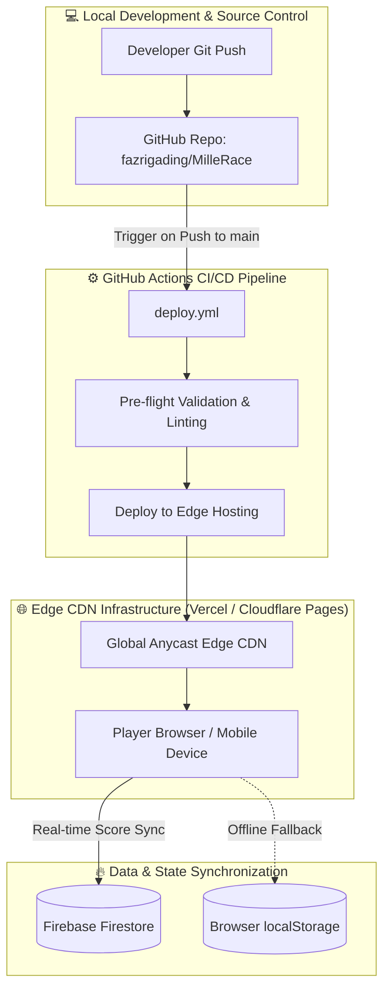

# 🚀 MilleRace — Production Deployment & Cloud Architecture Plan

> **Project:** MilleRace — Media & Information Literacy (MIL) Gamified Relay Race Web App  
> **Event:** UNESCO Youth Hackathon 2026  
> **Team:** Mulawarman University (Samarinda, East Kalimantan, Indonesia)  
> **Target Environment:** Global Edge CDN (Vercel / Cloudflare Pages) + Firebase Firestore Real-Time Cloud Leaderboard  
> **Pipeline:** Automated GitHub Actions CI/CD (`main` branch)  
> **Status:** Ready for Implementation  

---

## 📋 Table of Contents
1. [Architecture Overview & Deployment Topology](#1-architecture-overview--deployment-topology)
2. [Infrastructure & Service Matrix](#2-infrastructure--service-matrix)
3. [Pre-Deployment Codebase & Asset Verification](#3-pre-deployment-codebase--asset-verification)
4. [Phase 1: Real-Time Global Leaderboard (Firebase Firestore)](#4-phase-1-real-time-global-leaderboard-firebase-firestore)
5. [Phase 2: Hosting Configuration (Vercel & Cloudflare Pages)](#5-phase-2-hosting-configuration-vercel--cloudflare-pages)
6. [Phase 3: GitHub Actions Automated CI/CD Pipeline](#6-phase-3-github-actions-automated-cicd-pipeline)
7. [Phase 4: Production Security Hardening & Edge Optimizations](#7-phase-4-production-security-hardening--edge-optimizations)
8. [Phase 5: Step-by-Step Execution Runbook](#8-phase-5-step-by-step-execution-runbook)
9. [Phase 6: Quality Assurance, Smoke Testing & Rollback Plan](#9-phase-6-quality-assurance-smoke-testing--rollback-plan)

---

## 1. Architecture Overview & Deployment Topology

MilleRace is built as a zero-dependency, high-performance static Single Page Application (SPA) utilizing semantic HTML5, Vanilla CSS3 with custom design tokens, and modular ES6+ JavaScript.



### Key Deployment Objectives:
- **Zero-Friction Global Delivery:** Sub-second asset delivery worldwide via Edge Anycast CDN.
- **Shared Live Leaderboard:** Cross-device competition and demographic rankings powered by Google Cloud Firestore.
- **Offline Resilience:** If offline or Firestore connection fails, gracefully fallback to `localStorage` without interrupting gameplay.
- **Continuous Delivery:** Automatic deployment triggered by every push to `main` branch with preview capabilities on pull requests.

---

## 2. Infrastructure & Service Matrix

| Service Area | Selected Provider / Standard | Specification / Free Tier Allocation |
|---|---|---|
| **Hosting & Edge CDN** | **Vercel** *(or Cloudflare Pages)* | Global Edge CDN, automated SSL, custom headers, DDoS protection |
| **Domain / URL** | **Platform Subdomain** | `https://millerace.vercel.app` *(or `https://millerace.pages.dev`)* |
| **Cloud Database** | **Google Firebase Firestore** | 50,000 reads/day, 20,000 writes/day, 1GB storage (Spark Plan - Free) |
| **Authentication / Security** | **Anonymous / Nickname-based** | Rules-enforced sanitized schema validation in Firestore |
| **CI/CD Automation** | **GitHub Actions** | `.github/workflows/deploy.yml` with automated edge sync |
| **Local Fallback** | **Web Storage API** | Browser `localStorage` cache for disconnected environments |

---

## 3. Pre-Deployment Codebase & Asset Verification

Before initiating deployment, verify and ensure all file paths and references conform to strict UNIX case-sensitivity rules used in production CDN environments:

### 3.1 Path & Case Sensitivity Audit Checklist
- [x] **Asset Paths**: Ensure all paths in `index.html`, `css/*.css`, and `js/*.js` use relative, lowercase, forward-slash paths (`assets/images/...`, `css/...`, `js/...`).
- [x] **SVG & PNG Extensions**: Standardize file extensions to prevent 404 errors on Linux-based edge runners (`.svg`, `.png`, `.jpg`).
- [x] **Font Embeds**: Verify local font paths in `css/design-tokens.css` correctly reference `assets/fonts/` (`bona-nova`, `cinzel`, `cutive-mono`).
- [x] **HTML5 Standards**: Verify `<meta name="viewport" content="width=device-width, initial-scale=1.0">` and favicon definitions.

---

## 4. Phase 1: Real-Time Global Leaderboard (Firebase Firestore)

To upgrade the standalone `localStorage` leaderboard into a live, shared global Hall of Fame for the UNESCO Hackathon racers, Firebase Firestore is integrated with an offline-first hybrid pattern.

### 4.1 Firebase Setup & Project Provisioning
1. Open the [Firebase Console](https://console.firebase.google.com/).
2. Click **Add Project** and name it `millerace-unesco-2026` (disable Google Analytics or enable as desired).
3. Under **Build**, select **Firestore Database** -> **Create Database**.
4. Select a region close to your primary audience (e.g., `asia-southeast1` / Singapore or `asia-east1`).
5. Choose **Start in production mode**.
6. Register a Web App (`MilleRace Web`) and copy the `firebaseConfig` object.

### 4.2 Firestore Security Rules (`firestore.rules`)
To prevent score tampering and enforce legitimate submissions, deploy the following security rules:

```javascript
rules_version = '2';
service cloud.firestore {
  match /databases/{database}/documents {
    
    // Leaderboard Collection Rules
    match /leaderboard/{entryId} {
      // Anyone can read top scores
      allow read: if true;
      
      // Strict validation for score write
      allow create: if request.resource.data.name is string
                    && request.resource.data.name.size() > 0 
                    && request.resource.data.name.size() <= 20
                    && request.resource.data.score is number
                    && request.resource.data.score >= 0 
                    && request.resource.data.score <= 100
                    && request.resource.data.ageGroup in ['6-12', '13-17', '18+']
                    && request.resource.data.character in ['Miller', 'Jen', 'Aidan', 'Lizzy']
                    && request.resource.data.timestamp is timestamp;
                    
      // Prevent updating or deleting existing records by clients
      allow update, delete: if false;
    }
  }
}
```

### 4.3 Client-Side Service Architecture (`js/firebase-service.js`)
Create a modular adapter `js/firebase-service.js` that connects Firestore while preserving local fallback:

```javascript
/* MilleRace - Cloud & Local Hybrid Leaderboard Service */
import { initializeApp } from "https://www.gstatic.com/firebasejs/10.12.0/firebase-app.js";
import { 
  getFirestore, 
  collection, 
  addDoc, 
  getDocs, 
  query, 
  orderBy, 
  limit, 
  serverTimestamp 
} from "https://www.gstatic.com/firebasejs/10.12.0/firebase-firestore.js";

// REPLACE WITH YOUR FIREBASE PROJECT CONFIG
const firebaseConfig = {
  apiKey: "YOUR_API_KEY",
  authDomain: "millerace-unesco-2026.firebaseapp.com",
  projectId: "millerace-unesco-2026",
  storageBucket: "millerace-unesco-2026.appspot.com",
  messagingSenderId: "YOUR_SENDER_ID",
  appId: "YOUR_APP_ID"
};

let db = null;
let isFirebaseOnline = false;

try {
  const app = initializeApp(firebaseConfig);
  db = getFirestore(app);
  isFirebaseOnline = true;
  console.log("🔥 Firebase Firestore connected successfully.");
} catch (e) {
  console.warn("⚠️ Firebase connection unavailable, using offline localStorage fallback.", e);
}

export const LeaderboardService = {
  // Fetch top 50 scores from Cloud or fallback to localStorage
  async fetchTopScores(category = 'all') {
    if (isFirebaseOnline && db) {
      try {
        const q = query(
          collection(db, "leaderboard"),
          orderBy("score", "desc"),
          orderBy("timestamp", "asc"),
          limit(50)
        );
        const snapshot = await getDocs(q);
        const cloudEntries = snapshot.docs.map((doc, idx) => ({
          id: doc.id,
          rank: idx + 1,
          name: doc.data().name,
          ageGroup: doc.data().ageGroup,
          score: doc.data().score,
          character: doc.data().character,
          timestamp: doc.data().timestamp ? doc.data().timestamp.toDate().toLocaleDateString() : 'Just now'
        }));

        if (cloudEntries.length > 0) {
          return cloudEntries;
        }
      } catch (err) {
        console.warn("Error fetching cloud leaderboard, falling back to local:", err);
      }
    }
    // Offline / LocalStorage Fallback
    return UI.getLeaderboardData();
  },

  // Record a completed race
  async submitScore(entry) {
    // 1. Always save to local storage first
    UI.saveLeaderboardResult(entry.name, entry.ageGroup, entry.score, entry.character);

    // 2. Sync to Cloud Firestore if online
    if (isFirebaseOnline && db) {
      try {
        await addDoc(collection(db, "leaderboard"), {
          name: entry.name,
          ageGroup: entry.ageGroup,
          score: Number(entry.score),
          character: entry.character,
          timestamp: serverTimestamp()
        });
        console.log("✅ Score synced to Firebase Firestore!");
      } catch (err) {
        console.error("Failed to sync score to cloud:", err);
      }
    }
  }
};
```

---

## 5. Phase 2: Hosting Configuration (Vercel & Cloudflare Pages)

### Option A: Vercel Configuration (`vercel.json`)
Create `vercel.json` in the root directory to enforce caching, asset optimization, and security headers:

```json
{
  "version": 2,
  "cleanUrls": true,
  "trailingSlash": false,
  "headers": [
    {
      "source": "/assets/(.*)",
      "headers": [
        {
          "key": "Cache-Control",
          "value": "public, max-age=31536000, immutable"
        }
      ]
    },
    {
      "source": "/css/(.*)",
      "headers": [
        {
          "key": "Cache-Control",
          "value": "public, max-age=86400, stale-while-revalidate=604800"
        }
      ]
    },
    {
      "source": "/js/(.*)",
      "headers": [
        {
          "key": "Cache-Control",
          "value": "public, max-age=86400, stale-while-revalidate=604800"
        }
      ]
    },
    {
      "source": "/(.*)",
      "headers": [
        {
          "key": "X-Content-Type-Options",
          "value": "nosniff"
        },
        {
          "key": "X-Frame-Options",
          "value": "DENY"
        },
        {
          "key": "X-XSS-Protection",
          "value": "1; mode=block"
        },
        {
          "key": "Referrer-Policy",
          "value": "strict-origin-when-cross-origin"
        }
      ]
    }
  ]
}
```

### Option B: Cloudflare Pages Configuration
If deploying via Cloudflare Pages:
1. Create `_headers` in root:
```text
/assets/*
  Cache-Control: public, max-age=31536000, immutable
/css/*
  Cache-Control: public, max-age=86400, stale-while-revalidate=604800
/js/*
  Cache-Control: public, max-age=86400, stale-while-revalidate=604800
/*
  X-Content-Type-Options: nosniff
  X-Frame-Options: DENY
  Referrer-Policy: strict-origin-when-cross-origin
```

---

## 6. Phase 3: GitHub Actions Automated CI/CD Pipeline

Create `.github/workflows/deploy.yml` to automatically build, validate, and deploy changes whenever code is pushed to `main` branch or a PR is created.

### 6.1 GitHub Workflow File: `.github/workflows/deploy.yml`

```yaml
name: 🚀 MilleRace CI/CD Deployment

on:
  push:
    branches:
      - main
  pull_request:
    branches:
      - main
  workflow_dispatch:

permissions:
  contents: read
  deployments: write

jobs:
  # STEP 1: Pre-deployment Code & Asset Linting
  validate:
    name: 🔍 Pre-flight Validation
    runs-on: ubuntu-latest
    steps:
      - name: 📥 Checkout Repository
        uses: actions/checkout@v4

      - name: 🧪 Verify HTML & Core Entry Files
        run: |
          echo "Checking essential files..."
          test -f index.html || (echo "❌ index.html is missing!" && exit 1)
          test -f css/main.css || (echo "❌ css/main.css is missing!" && exit 1)
          test -f js/app.js || (echo "❌ js/app.js is missing!" && exit 1)
          test -d assets/images || (echo "❌ assets/images directory missing!" && exit 1)
          echo "✅ All core entry files verified."

      - name: 🔎 Scan for Broken Internal Links
        run: |
          echo "Scanning index.html asset references..."
          grep -o 'src="[^"]*"' index.html | cut -d'"' -f2 | while read file; do
            if [[ "$file" != http* ]] && [[ "$file" != *'#'* ]] && [[ ! -z "$file" ]]; then
              clean_file=$(echo "$file" | cut -d'?' -f1)
              if [ ! -f "$clean_file" ]; then
                echo "⚠️ Warning: Missing asset reference: $clean_file"
              fi
            fi
          done
          echo "✅ Asset scan completed."

  # STEP 2: Deploy to Production (Vercel)
  deploy-vercel:
    name: 🌐 Deploy to Vercel Edge
    needs: validate
    if: github.ref == 'refs/heads/main'
    runs-on: ubuntu-latest
    steps:
      - name: 📥 Checkout Repository
        uses: actions/checkout@v4

      - name: ⚡ Deploy to Vercel Production
        uses: amondnet/vercel-action@v25
        with:
          vercel-token: ${{ secrets.VERCEL_TOKEN }}
          vercel-org-id: ${{ secrets.VERCEL_ORG_ID }}
          vercel-project-id: ${{ secrets.VERCEL_PROJECT_ID }}
          vercel-args: '--prod'
          working-directory: ./
```

### 6.2 Required GitHub Repository Secrets
Navigate to **GitHub Repository -> Settings -> Secrets and variables -> Actions** and add:
- `VERCEL_TOKEN`: Vercel Personal Access Token ([Generate here](https://vercel.com/account/tokens))
- `VERCEL_ORG_ID`: Found in `.vercel/project.json` or team settings
- `VERCEL_PROJECT_ID`: Found in project General Settings on Vercel

---

## 7. Phase 4: Production Security Hardening & Edge Optimizations

### 7.1 Cross-Site Scripting (XSS) & Input Sanitization
Ensure player nicknames and submitted fields in `js/app.js` and `js/ui.js` are strictly sanitized before insertion into the DOM:
```javascript
function escapeHTML(str) {
  return String(str || '')
    .replace(/&/g, '&amp;')
    .replace(/</g, '&lt;')
    .replace(/>/g, '&gt;')
    .replace(/"/g, '&quot;')
    .replace(/'/g, '&#039;');
}
```

### 7.2 Score & Timer Anti-Tamper Logic
- Enforce ceiling validation: Total score must never exceed 100 points (`Math.min(100, Math.max(0, score))`).
- Validate completion timestamp: Reject scores completed in less than 10 seconds to prevent bot spamming.

### 7.3 Core Web Vitals Optimization Targets
- **Largest Contentful Paint (LCP):** < 1.8s (SVG hero assets optimized)
- **Cumulative Layout Shift (CLS):** < 0.05 (explicit `width` and `height` on all stage containers)
- **Interaction to Next Paint (INP):** < 100ms (zero blocking heavy framework overhead)

---

## 8. Phase 5: Step-by-Step Execution Runbook

Follow these sequential steps to complete the production deployment:

### ⚙️ Step 1: Connect Vercel Project
1. Log in to [Vercel Dashboard](https://vercel.com).
2. Click **Add New...** -> **Project**.
3. Import the GitHub repository: `fazrigading/MilleRace`.
4. Configure Project:
   - **Framework Preset**: `Other`
   - **Root Directory**: `./`
   - **Build Command**: *Leave blank (static)*
   - **Output Directory**: *Leave blank (root)*
5. Click **Deploy**. Vercel will assign a production URL: `https://millerace.vercel.app`.

### ⚙️ Step 2: Configure Firebase Project & Credentials
1. Create a Firebase Web Project as detailed in [Section 4.1](#41-firebase-setup--project-provisioning).
2. Paste Firebase credentials into `js/firebase-service.js`.
3. Deploy Firestore Security Rules via Firebase Console -> Firestore -> Rules.

### ⚙️ Step 3: Setup GitHub Actions Automation
1. Generate a Vercel Token from Vercel Account Settings.
2. Link the repository secrets in GitHub Actions (`VERCEL_TOKEN`, `VERCEL_ORG_ID`, `VERCEL_PROJECT_ID`).
3. Commit and push the `.github/workflows/deploy.yml` file to `main`.
4. Check the **Actions** tab in GitHub to observe the live green deployment build.

---

## 9. Phase 6: Quality Assurance, Smoke Testing & Rollback Plan

### 9.1 End-to-End Smoke Test Checklist
After deployment, run through this verification test on both desktop and mobile devices:

| Test Item | Verification Procedure | Expected Outcome | Pass/Fail |
|---|---|---|---|
| **1. Landing & Navigation** | Click all nav links (`Home`, `About Us`, `Our Team`, `Our Mission`, `Leaderboard`) | Smooth transitions with active golden yellow pill indicator | ⬜ |
| **2. Registration Modal** | Enter nickname and select age group | Profile stored in `GameState.player`, Stage 1 starts | ⬜ |
| **3. Global Timer Engine** | Check countdown across all 4 stages | 3-minute timer ticks down consistently without resetting | ⬜ |
| **4. Stage 1 (Miller)** | Select artwork cards | Real artworks accepted, decoys prompt feedback, Key #1 awarded | ⬜ |
| **5. Stage 2 (Jen)** | Complete book titles | Missing words validate correctly, Key #2 awarded | ⬜ |
| **6. Stage 3 (Aidan)** | Rate 5 text excerpts | AIAS classification advances properly, Key #3 awarded | ⬜ |
| **7. Stage 4 (Lizzy)** | Answer 4 PISA questions | Weighted points calculate, Final Key unlocks exit | ⬜ |
| **8. Final Results Card** | Verify score calculation and character match | Accurate score display (0-100), personalized archetype shown | ⬜ |
| **9. Live Leaderboard Sync** | Check leaderboard page after game completion | Racer's name appears with correct rank, score, and badge | ⬜ |
| **10. Responsive Layout** | Test viewport sizes from 360px (mobile) to 1920px (desktop) | Fluid glassmorphism layout with no horizontal clipping | ⬜ |

### 9.2 Instant Rollback Procedure
If a breaking issue occurs in production:
1. **Instant Vercel Rollback:**
   - Open Vercel Dashboard -> `MilleRace` -> **Deployments**.
   - Locate the previous stable deployment and click **Instant Rollback**.
2. **Git Revert:**
   ```bash
   git revert HEAD
   git push origin main
   ```
   GitHub Actions will automatically trigger and redeploy the previous working commit within 30 seconds.

---

*Plan prepared for **UNESCO Youth Hackathon 2026** submission by **Fazri Gading & Mulawarman University Web Development Team**.*
