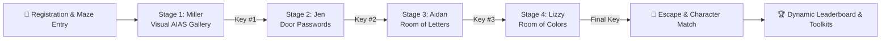

# MilleRace 🏁
### *Escape the Maze AI Wove for You*

[](https://en.unesco.org/)
[](LICENSE)
[](https://unmul.ac.id/)
[](#theoretical-frameworks)

**MilleRace** is an immersive, gamified Media and Information Literacy (MIL) relay race web game. Built for the **UNESCO Youth Hackathon 2026** under the theme *"Play Your Part: Youth Designing the Future of Media Information and Literacy"*, MilleRace challenges players to race against a 3-minute countdown across 4 interactive puzzle stages to outread generative machine algorithms, collect keys, escape the digital maze, and match with an inspiring literary character archetype.

---

## 🌟 Table of Contents
- [Background & Problem Statement](#-background--problem-statement)
- [Key Features](#-key-features)
- [Theoretical Frameworks](#-theoretical-frameworks)
- [The 4-Stage Relay Journey](#-the-4-stage-relay-journey)
- [Character Archetypes & Scoring](#-character-archetypes--scoring)
- [Pages & Navigation](#-pages--navigation)
- [Project Architecture & Tech Stack](#-project-architecture--tech-stack)
- [Project Structure](#-project-structure)
- [Getting Started](#-getting-started)
- [Project Team](#-project-team)
- [3-Year Strategic Roadmap](#-3-year-strategic-roadmap)
- [License](#-license)

---

## 📖 Background & Problem Statement

### 1. The Indonesian Literacy Paradox
According to Badan Pusat Statistik (BPS, 2024), only 14 of 34 provinces in Indonesia maintain accessible public libraries with digital catalogue data. With an average borrowing rate of only 2 literacy items per person annually and historically low rankings on triennial PISA reading tests, physical access and format fatigue remain significant bottlenecks.

However, seasonal public book exhibitions such as *Semesta Buku* and *Big Bad Wolf* regularly draw millions of attendees and distribute over 5 million newly published books. The latent passion for literature and storytelling is immense—readers simply need modern, interactive, and non-punitive digital entry points.

### 2. Generative AI & Digital Misinformation
The explosion of generative image models and Large Language Models (LLMs) has blurred the line between genuine human creativity and algorithmic output. From synthesized artwork to fabricated news and hallucinated citations, modern readers must cultivate sharp critical evaluation skills.

MilleRace gamifies media discernment, teaching users how to detect AI-generated artifacts, verify sources, and evaluate complex textual inferences under timed pressure.

---

## ✨ Key Features

- ⏱️ **Shared 3-Minute Relay Timer:** Fast-paced countdown engine keeping racers engaged across all 4 stages.
- 🎨 **Visual AIAS Discrimination:** Spot subtle prompt artifacts, spatial anomalies, and synthetic symmetry vs. authentic human masterpieces.
- 📚 **Literary Title Reconstruction:** Fill missing words from world classics and modern literature to unlock door passwords.
- 🔍 **Textual Authenticity Classification:** Grade text excerpts on a 4-point human-to-synthetic scale.
- 🧠 **High-Order PISA Inferential Reading:** Multi-layered reading comprehension questions with weighted scoring.
- 🏆 **Dynamic Local Leaderboard:** Real-time Hall of Fame with demographic category filtering (All, 6–12, 13–17, 18+), live search, and top 3 podium highlights.
- 🎁 **Tailored Post-Game Recommendations:** Direct access to digitized public libraries (*Perpustakaan Nasional Digital*, *Bank Indonesia*), open archives (*Project Gutenberg*, *Internet Archive*), and critical thinking toolkits.
- 🧭 **Responsive Navigation Bar:** Sleek top-right glassmorphism navbar with a dynamic golden yellow rounded rectangular indicator.

---

## 📐 Theoretical Frameworks

### 1. Artificial Intelligence Assessment Scale (AIAS)
Applied in Stages 1 & 3 to distinguish AI-generated synthetic content from authentic human creations across 5 core parameters:
1. **Symmetry:** Evaluating unnatural mathematical perfection vs. natural organic balance.
2. **Expressionalism:** Assessing genuine emotional nuance vs. generic prompt-generated surfaces.
3. **Distinctions:** Spotting unique human brushstrokes and idiosyncrasies vs. model artifact patterns.
4. **Proportionality:** Identifying anatomical anomalies, unnatural tangents, and spatial logic errors.
5. **Memorability:** Distinguishing original narrative depth from repetitive algorithmic templates.

### 2. PISA Reading Scale & CEFR Standards
Mapped into non-punitive character archetypes across PISA Levels 1–6 and CEFR A1–C1 to guide readers toward personalized growth rather than test anxiety.

---

## 🗺️ The 4-Stage Relay Journey



1. **Stage 1 — Miller's Gallery (Visual AIAS):**
   - *Setting:* Warm-toned art gallery.
   - *Challenge:* Eliminate AI-generated decoy paintings and select genuine human artwork.
   - *Reward:* Key #1.
2. **Stage 2 — Jen's Door Passwords (Literary Knowledge):**
   - *Setting:* Playground wonderland with interlocked doors.
   - *Challenge:* Complete 10 famous book titles (*Anne of Green Gables*, *The Kite Runner*, *Norwegian Wood*, etc.).
   - *Reward:* Key #2 (*"Old ways won't open new doors!"*).
3. **Stage 3 — Aidan's Room of Letters (Textual AIAS):**
   - *Setting:* Newspaper floor chamber with hanging key mobiles.
   - *Challenge:* Evaluate 5 text excerpts and classify them as `[Human]`, `[Somewhat Human]`, `[Barely Human]`, or `[Not Human]`.
   - *Reward:* Key #3.
4. **Stage 4 — Lizzy's Room of Colors (PISA Reading Scale):**
   - *Setting:* Vibrant room bursting with surreal colors and floating books.
   - *Challenge:* Answer 4 deep inferential comprehension questions with weighted point values (0, 3, or 5 points).
   - *Reward:* Final Key & Maze Exit.

---

## 🎭 Character Archetypes & Scoring

Based on the total score across all stages (0–100%), players match with a character archetype:

| Character | Points | PISA Level | CEFR Level | Archetype Profile & Focus |
|---|---|---|---|---|
| **Miller** | 1 – 25 pts | Level 1–2 | A1–A2 | *Curious Explorer:* Loves adventures and clues; benefits from comics, nighttime stories, and fun facts. |
| **Jen** | 26 – 50 pts | Level 3–4 | B1 | *Energetic Fact-Checker:* Exploring the world with imagination; builds habits through diaries and fact-checking. |
| **Aidan** | 51 – 75 pts | Level 5 | B2 | *Critical Inquirer:* Books are his window to the world; excels at source citations, references, and timelines. |
| **Lizzy** | 76 – 100 pts | Level 6 | C1 | *Literary Wiz:* Deep analytical thinker; reads complex charts, creates literature-inspired art, and fights misinformation. |

---

## 🌐 Pages & Navigation

The Single Page Application (SPA) features a persistent top navigation bar with a golden yellow pill active indicator:

- **Home (`screen-landing`):** Hero showcase, How to Play cards, What is MilleRace section, Character intros, and registration modal.
- **About Us (`screen-about`):** Detailed breakdown of the Indonesian Literacy Paradox, UNESCO hackathon alignment, AIAS 5 parameters, and stage overviews.
- **Our Team (`screen-team`):** Mulawarman University student team members, academic backgrounds, roles, and skill tags.
- **Our Mission (`screen-mission`):** 5 Strategic Pillars, 3-Year Strategic Roadmap (2026–2028), and community call to action.
- **Leaderboard (`screen-leaderboard`):** Top 3 podium showcase, demographic filters, live search, and automatic recording of completed game results.

---

## 💻 Project Architecture & Tech Stack

- **Frontend Core:** HTML5 Semantic Structure, Vanilla JavaScript (ES6+ Modules)
- **Styling Architecture:** Vanilla CSS3 with Design Tokens (`design-tokens.css`), responsive Flexbox/Grid, Glassmorphism, and keyframe micro-animations
- **Typography:** Google Fonts (`Cinzel` for headings, `Bona Nova` for body copy, `Cutive Mono` for metrics & data)
- **State Management:** Custom reactive state store (`state.js`) with stage progression and key collection
- **Persistence:** Browser `localStorage` for offline-capable leaderboard rankings and racer history
- **No Heavy Framework Overhead:** Zero external UI framework dependencies for instant loading speed and cross-browser accessibility

---

## 📁 Project Structure

```
MilleRace/
├── index.html                    # Single Page Application entry point
├── README.md                     # Project documentation
├── assets/                       # Unified lowercase asset library
│   ├── fonts/                    # Local TTF fonts (bona-nova, cinzel, cutive-mono)
│   └── images/
│       ├── backgrounds/          # Stage backgrounds (Level 1.png, Level 2.png)
│       ├── characters/
│       │   ├── stills/           # Character portraits (Miller, Jen, etc.)
│       │   └── animations/       # Walk, jump, talk sprite sequences
│       ├── questions/
│       │   └── stage-1/          # Stage 1 artwork questions (1A.jpg to 4C.jpg)
│       ├── ui/                   # Landing, question, and result UI vector elements
│       └── icons/                # Brand logos and interface icons
├── css/
│   ├── design-tokens.css         # Color palette, typography tokens, and CSS variables
│   ├── main.css                  # Global layout, HUD bar, modal overlay, and buttons
│   ├── landing.css               # Landing hero, how-to-play cards, character intros
│   ├── pages.css                 # About Us, Our Team, Our Mission, Leaderboard styles
│   ├── game-stages.css           # Puzzle layouts for Stages 1 to 4
│   └── result.css                # Final results card and recommendation toolkit
├── js/
│   ├── config.js                 # Stage question matrices, dialogue, and character data
│   ├── state.js                  # Player profile, stage scores, and key tracking
│   ├── timer.js                  # 3-minute global countdown timer component
│   ├── ui.js                     # Screen switcher, dialogue typewriter, leaderboard renderer
│   ├── gameEngine.js             # Stage transition engine, puzzle validation, and scoring
│   └── app.js                    # Event listeners, modal controllers, and app bootstrap
└── docs/                         # Project Documentation & Reference Vault
    ├── prd.md                    # Product Requirement Document
    ├── character-profiles.txt    # Pedagogical character definitions & reading lists
    ├── proposal/                 # Proposal Draft (.docx & .pdf)
    ├── scripts/                  # Final script screenplay (.docx & .pdf)
    └── design-references/        # Figma CSS dumps, UI reference captures, screenshots
```

---

## 🚀 Getting Started

No build tools or Node.js installations are required. MilleRace runs natively in any modern web browser.

### Option 1: Direct Browser Launch
Simply open `index.html` in your favorite web browser (Chrome, Firefox, Safari, Edge):
```bash
# Windows
start index.html

# macOS
open index.html

# Linux
xdg-open index.html
```

### Option 2: Local HTTP Server (Python)
To test with a local server:
```bash
# Python 3
python -m http.server 8000
```
Then navigate to `http://localhost:8000` in your browser.

---

## 👥 Project Team

Developed with pride by students of **Mulawarman University**, Samarinda, East Kalimantan, Indonesia:

1. **Syahna Maryam** — *Project Manager 1, Lead UX Writer & Character Designer* (Senior-year, English Literature)
2. **Chairil Aminullah** — *Project Manager 2, Creative Director & UI/UX Designer* (Junior-year, English Literature)
3. **Syema Chaelint Joshepine Karundaeng** — *Lead Illustrator & Visual Artist* (Junior-year, International Relations)
4. **Fazri Rahmad Nor Gading** — *Front-End & Back-End Programmer* (Penultimate, Computer Science)
5. **Muhammad Farrel Sirah** — *Web Developer* (Senior-year, Computer Science)
6. **Muhammad Fahrezy Al Faris** — *Lead Researcher & Pitch Presenter* (Senior-year, International Relations)

---

## 📅 3-Year Strategic Roadmap

- **Year 1 (2026) — Foundation & Pilot Validation:** Alpha/Beta testing with 30–50 regional users in Samarinda; school tours; user testimonies; public library partnerships.
- **Year 2 (2027) — Regional Scaling across East Kalimantan:** Partnerships with 5+ schools and 5+ public libraries; 1,000+ active racers; curriculum integration.
- **Year 3 (2028) — National & Global Outreach:** Multi-language support; partnership with UNESCO City of Literature networks; scaling to 5,000+ youth readers globally.

---

## 📄 License

This project is licensed under the [MIT License](LICENSE). Built for educational and non-profit research for the **UNESCO Youth Hackathon 2026**.
