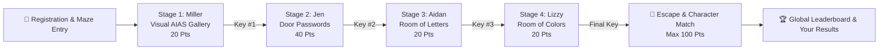

# MilleRace 🏁
### *Escape the Maze AI Wove for You*

[](https://en.unesco.org/)
[](LICENSE)
[](https://unmul.ac.id/)
[](#-theoretical-frameworks)
[](#-cloud-database--persistence)
[](#-deployment--cicd-automation)

**MilleRace** is an immersive, gamified Media and Information Literacy (MIL) relay race web game. Built for the **UNESCO Youth Hackathon 2026** under the theme *"Play Your Part: Youth Designing the Future of Media Information and Literacy"*, MilleRace challenges players to race against a 3-minute countdown across 4 interactive puzzle stages to outread generative machine algorithms, collect keys, escape the digital maze, and match with an inspiring literary character archetype.

---

## 🌟 Table of Contents
- [Background & Problem Statement](#-background--problem-statement)
- [Key Features](#-key-features)
- [Theoretical Frameworks](#-theoretical-frameworks)
- [The 4-Stage Relay Journey](#%EF%B8%8F-the-4-stage-relay-journey)
- [Point System & Scoring Matrix](#-point-system--scoring-matrix)
- [Character Archetypes & Matching](#-character-archetypes--matching)
- [Pages & Navigation](#-pages--navigation)
- [Cloud Database & Persistence](#-cloud-database--persistence)
- [Deployment & CI/CD Automation](#-deployment--cicd-automation)
- [Project Architecture & Tech Stack](#-project-architecture--tech-stack)
- [Project Structure](#-project-structure)
- [Developer Mode & Debug Controls](#-developer-mode--debug-controls)
- [Getting Started](#-getting-started)
- [Automated Testing & Verification](#-automated-testing--verification)
- [Project Team](#-project-team)
- [3-Year Strategic Roadmap](#-3-year-strategic-roadmap)
- [License](#-license)

---

## 📖 Background & Problem Statement

### 1. The Indonesian Literacy Paradox
According to Badan Pusat Statistik (BPS, 2024), only 14 of 34 provinces in Indonesia maintain accessible public libraries with digital catalogue data. With an average borrowing rate of only 2 literacy items per person annually and historically low rankings on triennial PISA reading tests, physical access and format fatigue remain significant bottlenecks.

However, seasonal public book exhibitions such as *Semesta Buku* and *Big Bad Wolf* regularly draw millions of attendees and distribute over 5 million newly published books. The latent passion for literature and storytelling is immense—readers simply need modern, interactive, and non-punitive digital entry points.

### 2. Generative AI & Digital Misinformation
The explosion of generative image models and Large Language Models (LLMs) has blurred the line between genuine human creativity and algorithmic output. From synthesized artwork to fabricated news and hallucinated citations, modern readers must cultivate sharp critical evaluation skills.

MilleRace gamifies media discernment, teaching users how to detect AI-generated artifacts, verify sources, and evaluate complex textual inferences under timed pressure.

---

## ✨ Key Features

- ⏱️ **Shared 3-Minute Relay Timer:** Fast-paced countdown engine keeping racers engaged across all 4 stages with pauses during narrative dialogues.
- 🎨 **Visual AIAS Discrimination:** Spot subtle prompt artifacts, spatial anomalies, and synthetic symmetry vs. authentic human masterpieces.
- 📚 **Literary Title Reconstruction:** Fill missing words from world classics and modern literature to unlock door passwords.
- 🔍 **Textual Authenticity Classification:** Grade text excerpts on a 4-point graduated human-to-synthetic scale.
- 🧠 **High-Order PISA Inferential Reading:** Multi-layered reading comprehension questions with weighted scoring.
- 🏆 **Global Leaderboard & "Your Results" History:**
  - **Global Leaderboard:** Demographic filtering (All, 6–12, 13–17, 18+), live search with automatic top 3 podium collapse.
  - **Your Results:** Persistent local history of every test completed on the browser, featuring full score breakdowns and direct **"View Final Result ➔"** interactive lookups.
- 📜 **Redesigned Serif Final Result Screen:**
  - **Celebratory Rank Banner:** Dynamic header (`"Congratulations for finishing the maze! You placed in #{leaderboard-rank} 🎉"`) computing real-time leaderboard placement.
  - **Unified Navigation & Background:** Standardized top navigation bar and rich radial-gradient dark background matching the entire platform.
  - **Enhanced Character Showcase:** Scaled character avatar standing over 50% taller than the parchment card with a bottom-anchored purple accent band.
  - **MIL Score & Progress Breakdown:** AIAS & PISA reading standards descriptions, animated score counter, and stage milestone chips (Visual AIAS, Literary, Textual AIAS, Critical Inferencing).
  - **Golden Ribbon Banner & Level Pills:** `Result-with-name.svg` badge with separate PISA and Cambridge Reading level badges.
  - **Character Lore & Misinformation Defense:** Character quotes, bios, and dynamic misinformation research links.
  - **Containerless Recommendations & Toolkit:** Clean, open presentation for curated home activities, book lists, and critical thinking resources.
  - **Standardized Site Footer:** Unified rounded purple container footer matching the Home page.
- ⬆️ **Global "Back to Top" Functionality:** Centered, accessible smooth-scroll button located above footers and at the base of every content screen.
- 🎁 **Tailored Post-Game Recommendations:** Direct access to digitized public libraries (*Perpustakaan Nasional Digital*, *Bank Indonesia*), open archives (*Project Gutenberg*, *Internet Archive*), and critical thinking toolkits.
- 🧭 **Universal Navigation Bar:** Sleek top glassmorphic navbar with a dynamic golden yellow active indicator across all screens.
- 🛠️ **Developer Debug Panel:** Built-in dev panel (`Ctrl+Shift+D`, `Alt+D`, or `~`) for rapid stage jumping, dialogue skipping, timer toggling, and score simulation.

---

## 📐 Theoretical Frameworks

### 1. Artificial Intelligence Assessment Scale (AIAS)
Applied in Stages 1 & 3 to distinguish AI-generated synthetic content from authentic human creations across 5 core parameters:
1. **Symmetry:** Evaluating unnatural mathematical perfection vs. natural organic balance.
2. **Expressionalism:** Assessing genuine emotional nuance vs. generic prompt-generated surfaces.
3. **Distinctions:** Spotting unique human brushstrokes and idiosyncrasies vs. model artifact patterns.
4. **Proportionality:** Identifying anatomical anomalies, unnatural tangents, and spatial logic errors.
5. **Memorability:** Distinguishing original narrative depth from repetitive algorithmic templates.

### 2. PISA Reading Scale & CEFR Standards
Mapped into non-punitive character archetypes across PISA Levels 1–6 and CEFR A1–C1 to guide readers toward personalized growth rather than test anxiety.

---

## 🗺️ The 4-Stage Relay Journey



1. **Stage 1 — Miller's Gallery (Visual AIAS):**
   - *Setting:* Warm-toned art gallery.
   - *Challenge:* Eliminate AI-generated decoy paintings and select genuine human artwork (4 questions $\times$ 5 pts = 20 pts).
   - *Reward:* Key #1.
2. **Stage 2 — Jen's Door Passwords (Literary Knowledge):**
   - *Setting:* Playground wonderland with interlocked doors.
   - *Challenge:* Complete 10 famous book titles (*Anne of Green Gables*, *The Kite Runner*, *Norwegian Wood*, etc.; 10 questions $\times$ 4 pts = 40 pts).
   - *Reward:* Key #2 (*"Old ways won't open new doors!"*).
3. **Stage 3 — Aidan's Room of Letters (Textual AIAS):**
   - *Setting:* Newspaper floor chamber with hanging key mobiles.
   - *Challenge:* Evaluate text excerpts on a 4-point rating scale (`Human`, `Somewhat Human`, `Barely Human`, `Not Human`; max 20 pts).
   - *Reward:* Key #3 (*"You've been reading!"*).
4. **Stage 4 — Lizzy's Room of Colors (PISA Reading Scale):**
   - *Setting:* Vibrant room bursting with surreal colors and floating books.
   - *Challenge:* Answer 4 deep inferential comprehension questions with weighted point values (0, 3, or 5 pts per question; 4 questions $\times$ 5 pts = 20 pts).
   - *Reward:* Final Key & Maze Exit.

---

## 🎯 Point System & Scoring Matrix

The scoring system calculates performance across all 4 stages up to a total of **100 points**:

| Stage | Domain & Focus | Question Count | Points Per Question | Stage Max Points |
|---|---|---|---|---|
| **Stage 1** | Visual AIAS Discrimination | 4 questions | 5 pts (correct answer) | **20 pts** |
| **Stage 2** | Literary Title Reconstruction | 10 questions | 4 pts (correct answer) | **40 pts** |
| **Stage 3** | Textual Authenticity Rating | 5 passages | Graduated scale (see below) | **20 pts** |
| **Stage 4** | PISA Inferential Comprehension | 4 questions | 0, 3, or 5 pts (weighted) | **20 pts** |
| **Total** | **Full Game Relay Score** | — | — | **100 pts** |

### Stage 3 Graduated Scoring Matrix

Stage 3 tests the ability to distinguish authentic human-written excerpts from AI-generated text:

| Question / Passage | Target Origin | Human | Somewhat Human | Barely Human | Not Human |
|---|---|---|---|---|---|
| **Q1 (Axolotls)** | Authentic Human | **5 pts** | 3 pts | 1 pt | 0 pts |
| **Q2 (English Breakfast)** | Authentic Human | **5 pts** | 3 pts | 1 pt | 0 pts |
| **Q3 (Valentine's Day)** | AI Generated | 0 pts | 1 pt | 3 pts | **5 pts** |
| **Q4 (1920s Uniforms)** | AI Generated | 0 pts | 1 pt | 3 pts | **5 pts** |
| **Q5 (Chopsticks History)** | Authentic Human | **5 pts** | 3 pts | 1 pt | 0 pts |

*Note: Stage 3 total score is capped at 20 points, preserving the balanced 100-point total.*

---

## 🎭 Character Archetypes & Matching

Based on the total score across all stages (0–100%), players match with a pedagogical character archetype:

| Character | Score Range | PISA Level | CEFR Level | Archetype Profile & Focus |
|---|---|---|---|---|
| **Miller** | 1 – 25 pts | Level 1–2 | A1–A2 | *Curious Explorer:* Loves adventures and clues; benefits from comics, nighttime stories, and fun facts. |
| **Jen** | 26 – 50 pts | Level 3–4 | B1 | *Energetic Fact-Checker:* Exploring the world with imagination; builds habits through diaries and fact-checking. |
| **Aidan** | 51 – 75 pts | Level 5 | B2 | *Critical Inquirer:* Books are his window to the world; excels at source citations, references, and timelines. |
| **Lizzy** | 76 – 100 pts | Level 6 | C1 | *Literary Wiz:* Deep analytical thinker; reads complex charts, creates literature-inspired art, and fights misinformation. |

---

## 🌐 Pages & Navigation

The Single Page Application (SPA) features a persistent top navigation bar with a golden yellow pill active indicator, paired with a centered "Back to Top" button on all content pages:

- **Home (`screen-landing`):** Hero showcase, How to Play cards, What is MilleRace section, Character intros, Back to Top button, and rounded purple site footer.
- **About Us (`screen-about`):** Detailed breakdown of the Indonesian Literacy Paradox, UNESCO hackathon alignment, AIAS 5 parameters, stage overviews, and Back to Top button.
- **Our Team (`screen-team`):** Mulawarman University student team members, academic backgrounds, roles, skill tags, and Back to Top button.
- **Our Mission (`screen-mission`):** 5 Strategic Pillars, 3-Year Strategic Roadmap (2026–2028), interactive dossier console, and Back to Top button.
- **Leaderboard (`screen-leaderboard`):**
  - **Global Leaderboard:** Demographic tabs, live search with auto-hiding podium, and live top scores.
  - **Your Results:** Personal test history list with full score breakdowns and one-click Final Result inspection.
  - **Back to Top:** Centered smooth-scroll button at the base of the page container.
- **Final Result (`screen-result`):** Complete analytical performance profile with celebratory leaderboard rank banner, enlarged character avatar hero, MIL score progress meter, containerless recommendations & toolkit, centered Back to Top button, and rounded purple footer.

---

## 🔥 Cloud Database & Persistence

MilleRace uses an **offline-first hybrid architecture**:
1. **Google Firebase Firestore:** Synchronizes real-time scores across devices for the global UNESCO Hackathon Leaderboard.
2. **Web Storage API (`localStorage`):** Caches leaderboard scores and stores the player's personal test run history (`mille_user_history`) locally on their browser.
3. **Security Rules (`firestore.rules`):** Enforces strict document schema validation on the cloud (string length $\le$ 25, score range 0–100, age group enum, and disallowing updates/deletes).
4. **Composite Indexes (`firestore.indexes.json`):** Ensures optimized sorting by `score` DESC and `timestamp` ASC for fair tie-breaking.

---

## 🚀 Deployment & CI/CD Automation

MilleRace is configured for automated Edge CDN deployment:

- **Edge CDN Hosting:** Configured via `vercel.json` with immutable asset caching (`Cache-Control: max-age=31536000`), clean URLs, and HTTP security headers (`X-Frame-Options: DENY`, `X-Content-Type-Options: nosniff`, `Referrer-Policy: strict-origin-when-cross-origin`).
- **GitHub Actions (`.github/workflows/deploy.yml`):**
  - **Pre-flight Validation:** Automatically checks for required HTML entry files, CSS stylesheets, JavaScript modules, and asset integrity.
  - **Automated Deployment:** Deploys directly to Vercel on every push to the `main` branch.
  - **Safe Secret Injection:** Injects production Firebase configuration dynamically during deployment, preventing API key exposure in Git history.

---

## 💻 Project Architecture & Tech Stack

- **Frontend Core:** HTML5 Semantic Structure, Vanilla JavaScript (ES6+ Modules)
- **Styling Architecture:** Vanilla CSS3 with Design Tokens (`design-tokens.css`), responsive Flexbox/Grid, Glassmorphism, and keyframe micro-animations
- **Typography:** Google Fonts (`Cinzel` for headings, `Bona Nova` for body and results, `Cutive Mono` for metrics & data)
- **State Management:** Custom reactive state store (`state.js`) with stage progression, point ceilings, and key tracking
- **Persistence & Cloud:** Google Firebase Firestore + Browser `localStorage` hybrid service (`leaderboardService.js`)
- **Testing & Verification:** `playwright-core` and `@playwright/test` wired directly to **Google Chrome** (`channel: 'chrome'`)
- **Zero Heavy Frameworks:** Zero external UI framework dependencies for instant loading speed, clean maintainability, and cross-browser accessibility

---

## 📁 Project Structure

```
MilleRace/
├── index.html                    # Single Page Application entry point
├── package.json                  # Dependencies and test/verification scripts
├── playwright.config.js          # Playwright test config wired to Google Chrome
├── firestore.rules               # Production Firebase Firestore security rules
├── firestore.indexes.json        # Firestore composite query index definitions
├── vercel.json                   # Vercel Edge CDN configuration & security headers
├── Deployment-Plan.md            # Comprehensive production deployment & runbook guide
├── README.md                     # Comprehensive project documentation
├── .github/
│   └── workflows/
│       └── deploy.yml            # GitHub Actions CI/CD automated deployment workflow
├── assets/                       # Unified asset library
│   ├── fonts/                    # Local TTF fonts (bona-nova, cinzel, cutive-mono)
│   └── images/
│       ├── backgrounds/          # Stage backgrounds (Level 1.png, Level 2.png)
│       ├── characters/
│       │   ├── stills/           # Transparent character portraits (Miller-no-bg, Jen-no-bg, etc.)
│       │   └── animations/       # Walk, jump, talk sprite sequences
│       ├── questions/
│       │   └── stage-1/          # Stage 1 artwork questions (1A.jpg to 4C.jpg)
│       ├── ui/                   # Landing, question, and result UI vector elements
│       └── icons/                # Brand logos and interface icons
├── css/
│   ├── design-tokens.css         # Color palette, typography tokens, and CSS variables
│   ├── main.css                  # Global layout, HUD bar, modal overlay, and buttons
│   ├── landing.css               # Landing hero, how-to-play cards, character intros
│   ├── pages.css                 # About Us, Our Team, Our Mission, Leaderboard & History styles
│   ├── game-stages.css           # Puzzle layouts for Stages 1 to 4
│   ├── result.css                # Final results card, serif styling, and recommendation toolkit
│   └── dev-mode.css              # Developer panel styling
├── js/
│   ├── config.js                 # Stage question matrices, dialogue, scoring matrix, and character profiles
│   ├── firebaseConfig.js         # Firebase configuration template & detection
│   ├── leaderboardService.js     # Hybrid Cloud Firestore + localStorage leaderboard & history service
│   ├── state.js                  # Player profile, stage scores (20/40/20/20), and key tracking
│   ├── timer.js                  # 3-minute global countdown timer component
│   ├── ui.js                     # Screen switcher, dialogue typewriter, leaderboard & history renderer
│   ├── gameEngine.js             # Stage transition engine, puzzle validation, and result renderer
│   ├── devMode.js                # Developer quick-stage navigation and state inspector
│   └── app.js                    # Event listeners, modal controllers, and app bootstrap
├── scripts/
│   ├── server.js                 # Zero-dependency local static HTTP server (port 8080)
│   └── verify.js                 # Standalone playwright-core Google Chrome test runner
├── tests/
│   └── mille-race.spec.js        # Playwright test suite for UI flows and Point System
└── docs/                         # Project Documentation & Reference Vault
    ├── prd.md                    # Product Requirement Document
    ├── character-profiles.txt    # Pedagogical character definitions & reading lists
    ├── proposal/                 # Proposal Draft (.docx & .pdf)
    ├── scripts/                  # Final script screenplay (.docx & .pdf)
    └── design-references/        # Figma CSS dumps, UI reference captures, screenshots
```

---

## 🛠️ Developer Mode & Debug Controls

MilleRace includes a built-in Developer Mode for testing, demonstrations, and rapid stage inspection:

- **Toggle Shortcuts:** Press `Ctrl + Shift + D`, `Alt + D`, or `~` (tilde) on your keyboard.
- **Quick Jump:** Navigate directly to any screen (Landing, About, Team, Mission, Stages 1–4, Result, Leaderboard, Register Modal).
- **Timer Control:** Toggle the 3-minute countdown timer on or off (paused).
- **Dialogue Toggle:** Instantly skip intro narrative dialogues for fast gameplay testing.
- **Score Simulator:** Simulate scores (20% Miller, 45% Jen, 70% Aidan, 95% Lizzy) with proportional 20/40/20/20 stage distributions.
- **Key Slots:** Manually unlock or lock keys 1 through 4.

---

## 🚀 Getting Started

### Option 1: Direct Browser Launch
Simply open `index.html` in your favorite web browser (Chrome, Edge, Firefox, Safari):
```bash
# Windows
start index.html

# macOS
open index.html

# Linux
xdg-open index.html
```

### Option 2: Local HTTP Server (Node.js)
Start the built-in zero-dependency static server on `http://localhost:8080`:
```bash
npm start
```

### Option 3: Local HTTP Server (Python)
```bash
# Python 3
python -m http.server 8000
```
Then navigate to `http://localhost:8000` in your browser.

---

## 🧪 Automated Testing & Verification

MilleRace uses **`playwright-core`** wired directly to the system-installed **Google Chrome** browser (`channel: 'chrome'`), eliminating the need for bulky Chromium bundle downloads.

### 1. Prerequisites
Ensure you have **Node.js** and **Google Chrome** installed on your system.

Install project dependencies:
```bash
npm install
```

### 2. Running Tests & Verifications

| Command | Description |
|---|---|
| `npm test` | Runs the full Playwright test suite headlessly in Google Chrome with automatic local web server management. |
| `npm run verify` | Runs a standalone `playwright-core` diagnostic script that starts a local server, navigates to the game in Google Chrome, checks DOM elements, and captures a full-page verification screenshot. |
| `npm run test:chrome` | Explicitly targets the Google Chrome test configuration. |
| `npm run test:ui` | Launches the interactive Playwright UI mode for visual debugging, time-travel inspection, and step-by-step tracing. |

---

## 👥 Project Team

Developed with pride by students of **Mulawarman University**, Samarinda, East Kalimantan, Indonesia:

1. **Syahna Maryam** — *Project Manager 1, Lead UX Writer & Character Designer* (Senior-year, English Literature)
2. **Chairil Aminullah** — *Project Manager 2, Creative Director & UI/UX Designer* (Junior-year, English Literature)
3. **Syema Chaelint Joshepine Karundaeng** — *Lead Illustrator & Visual Artist* (Junior-year, International Relations)
4. **Fazri Rahmad Nor Gading** — *Lead Software Engineer & Full-Stack Developer* (Penultimate, Computer Science) — Architected and built the entire web game application end-to-end (SPA framework, all 4 game stages, UI/UX implementation, cloud & local leaderboard synchronization, timer engine, and deployment pipeline).
5. **Muhammad Farrel Sirah** — *Game Logic & Project Planner* (Senior-year, Computer Science) — Formulated foundational game logic, scoring distribution rules, and coding project planning.
6. **Muhammad Fahrezy Al Faris** — *Lead Researcher & Pitch Presenter* (Senior-year, International Relations)

---

## 📅 3-Year Strategic Roadmap

- **Year 1 (2026) — Foundation & Pilot Validation:** Alpha/Beta testing with 30–50 regional users in Samarinda; school tours; user testimonies; public library partnerships.
- **Year 2 (2027) — Regional Scaling across East Kalimantan:** Partnerships with 5+ schools and 5+ public libraries; 1,000+ active racers; curriculum integration.
- **Year 3 (2028) — National & Global Outreach:** Multi-language support; partnership with UNESCO City of Literature networks; scaling to 5,000+ youth readers globally.

---

## 📄 License

This project is licensed under the [MIT License](LICENSE). Built for educational and non-profit research for the **UNESCO Youth Hackathon 2026**.
