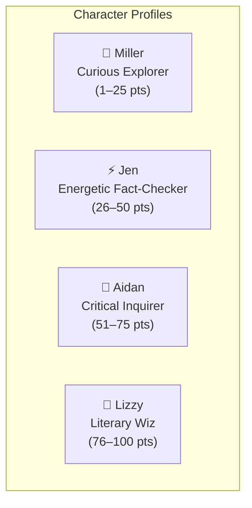

# Character Archetypes & Matching 🎭

> Pedagogical character personas, PISA/CEFR mapping matrices, literacy profiles, and personalized reading recommendations in **MilleRace**. For original source dialogues and reading lists, see [Character Profiles & Lore](character-profiles.md).

---

## 🌟 The 4 MilleRace Guardians

MilleRace features four distinct character archetypes, each serving as both a stage guardian and a post-game reading profile match.

---

## 📊 Pedagogical Matching Matrix

| Character | Score Band | PISA Level | CEFR Level | Core Traits & Learning Persona |
|---|---|---|---|---|
| **Miller** | **1 – 25 pts** | Level 1–2 | A1–A2 | **Curious Explorer:** Loves finding clues and adventures. Benefits from visual storytelling, comics, short mysteries, and curiosity-driven discovery. |
| **Jen** | **26 – 50 pts** | Level 3–4 | B1 | **Energetic Fact-Checker:** Highly observant, imaginative, and energetic. Builds strong literacy habits through diary keeping, real-life memoirs, and source checking. |
| **Aidan** | **51 – 75 pts** | Level 5 | B2 | **Critical Inquirer:** Resilient, analytical, and structured. Books are his window to the world; excels at evaluating citations, timelines, and comparative sources. |
| **Lizzy** | **76 – 100 pts** | Level 6 | C1 | **Literary Wiz:** Deep analytical thinker and creative synthesist. Deconstructs complex rhetoric, reads intricate graphs, and creates art inspired by literature. |

---

## 📖 Deep Profiles & Tailored Reading Pathways

### 1. Miller — *The Curious Explorer*
* **Score Band:** 1 – 25 points
* **PISA / Cambridge Rating:** Level 1–2 (CEFR A1–A2)
* **Persona:** *"Miller loves finding clues for his adventures, but he often gets lost without his keys. Curious and ready for new chapters, Miller has an exciting journey ahead!"*
* **Recommended Home Activities:**
  - Nighttime bedtime stories and comic book reading.
  - Solving picture crosswords, riddle games, and clue hunts.
* **Curated Book Recommendations:**
  1. *Charlotte's Web* by E. B. White ([Internet Archive](https://archive.org/details/CharlottesWeb))
  2. *Keluarga Cemara* by Arswendo Atmowiloto ([Perpustakaan Nasional Digital](https://kios-perpustakaan.jakarta.go.id/catalogue/detail/99218))
* **Critical Thinking Resources:**
  - [University of Sheffield: Approaches to Thinking Critically](https://sheffield.ac.uk/study-skills/research/approaches/thinking-critically)
  - [Bookr Class: Critical Thinking Activities for Young Readers](https://bookrclass.com/blog/critical-thinking-activities-for-kids/)

---

### 2. Jen — *The Energetic Fact-Checker*
* **Score Band:** 26 – 50 points
* **PISA / Cambridge Rating:** Level 3–4 (CEFR B1)
* **Persona:** *"Witty and energetic, Jen is exploring the world with imagination! She knows everything, but always double checks... factually!"*
* **Recommended Home Activities:**
  - Daily journaling and personal diary writing.
  - Comparing news headlines with friends or family.
* **Curated Book Recommendations:**
  1. *The Fault in Our Stars* by John Green ([Google Books](https://books.google.co.id/books/about/The_Fault_in_Our_Stars.html?hl=id&id=Qk8n0olOX5MC&redir_esc=y))
  2. *Laskar Pelangi* by Andrea Hirata (Available in regional public libraries)
* **Misinformation Defense Toolkit:**
  - [Reuters Fact Check Portal](https://www.reuters.com/fact-check/)
  - [MediaSmarts: Break the Fake Campaign](https://mediasmarts.ca/break-fake)

---

### 3. Aidan — *The Critical Inquirer*
* **Score Band:** 51 – 75 points
* **PISA / Cambridge Rating:** Level 5 (CEFR B2)
* **Persona:** *"Adventurous and resilient, Aidan is on the move! Books are his window to the world. He only accepts legit sources, inspecting citations and historical timelines."*
* **Recommended Home Activities:**
  - Reading multi-volume series and analyzing film adaptations.
  - Tracking cross-references and primary source citations.
* **Curated Book Recommendations:**
  1. *1984* by George Orwell ([Internet Archive PDF](https://dn790002.ca.archive.org/0/items/NineteenEightyFour-Novel-GeorgeOrwell/orwell1984.pdf))
  2. *Gadis Kretek* by Ratih Kumala (Available at Bank Indonesia Library & regional archives)
* **Research & Citation Verification Toolkit:**
  - [Penn State University Libraries: Citation Searching & Bibliometrics](https://guides.libraries.psu.edu/bibliometrics/citationsearching)
  - [Academic Writing Reference Guide: Citations & Context](https://medium.com/@kichu.josef/all-you-need-to-know-about-references-citations-in-academic-writing-9174922d5f9e)

---

### 4. Lizzy — *The Literary Wiz*
* **Score Band:** 76 – 100 points
* **PISA / Cambridge Rating:** Level 6 (CEFR C1)
* **Persona:** *"Lizzy is the wiz! She reads like there's no tomorrow. She reads charts and complex data structures like an open book, transforming literature into art while actively defending against deception."*
* **Recommended Home Activities:**
  - Creating thematic art or essays inspired by literary works.
  - Participating in community book discussions and mentoring junior readers.
* **Curated Book Recommendations:**
  1. *The Strange Case of Dr Jekyll and Mr Hyde* by Robert Louis Stevenson ([Project Gutenberg](https://www.gutenberg.org/files/43/43-h/43-h.htm))
  2. *Bumi Manusia* by Pramoedya Ananta Toer (Available in local public libraries)
* **Advanced Data & Information Literacy Toolkit:**
  - [UC Berkeley School of Information: Beginner's Guide to Data Literacy](https://ischoolonline.berkeley.edu/blog/beginners-guide-improving-data-literacy/)
  - [Dataversity: Data Literacy Essentials](https://www.dataversity.net/articles/data-literacy-essentials-what-you-need-to-know/)

---

[⬅️ Point System & Scoring Matrix](scoring-system.md) | [Next: Key Features ➔](features.md)
