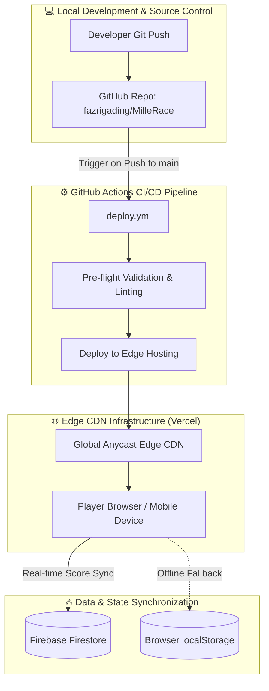

# Production Deployment & Cloud Architecture Guide 🚀

> **Project:** MilleRace — Media & Information Literacy (MIL) Gamified Relay Race Web App  
> **Event:** UNESCO Youth Hackathon 2026  
> **Team:** Mulawarman University (Samarinda, East Kalimantan, Indonesia)  
> **Target Environment:** Global Edge CDN (Vercel) + Firebase Firestore Real-Time Cloud Leaderboard  
> **Pipeline:** Automated GitHub Actions CI/CD (`main` branch)  

---

## 📋 Table of Contents
1. [Architecture Overview & Deployment Topology](#1-architecture-overview--deployment-topology)
2. [Infrastructure & Service Matrix](#2-infrastructure--service-matrix)
3. [Pre-Deployment Codebase & Asset Verification](#3-pre-deployment-codebase--asset-verification)
4. [Phase 1: Real-Time Global Leaderboard (Firebase Firestore)](#4-phase-1-real-time-global-leaderboard-firebase-firestore)
5. [Phase 2: Hosting Configuration (Vercel & Edge CDN)](#5-phase-2-hosting-configuration-vercel--edge-cdn)
6. [Phase 3: GitHub Actions Automated CI/CD Pipeline](#6-phase-3-github-actions-automated-cicd-pipeline)
7. [Phase 4: Production Security Hardening & Edge Optimizations](#7-phase-4-production-security-hardening--edge-optimizations)
8. [Phase 5: Step-by-Step Execution Runbook](#8-phase-5-step-by-step-execution-runbook)
9. [Phase 6: Quality Assurance, Smoke Testing & Rollback Plan](#9-phase-6-quality-assurance-smoke-testing--rollback-plan)

---

## 1. Architecture Overview & Deployment Topology

MilleRace is built as a zero-dependency, high-performance static Single Page Application (SPA) utilizing semantic HTML5, Vanilla CSS3 with custom design tokens, and modular ES6+ JavaScript.



### Key Deployment Objectives:
- **Zero-Friction Global Delivery:** Sub-second asset delivery worldwide via Edge Anycast CDN (`https://millerace.vercel.app`).
- **Shared Live Leaderboard:** Cross-device competition and demographic rankings powered by Google Cloud Firestore.
- **Offline Resilience:** If offline or Firestore connection fails, gracefully fallback to `localStorage` without interrupting gameplay.
- **Continuous Delivery:** Automatic deployment triggered by every push to `main` branch.

---

## 2. Infrastructure & Service Matrix

| Service Area | Selected Provider / Standard | Specification / Free Tier Allocation |
|---|---|---|
| **Hosting & Edge CDN** | **Vercel** | Global Edge CDN, automated SSL, custom headers, DDoS protection |
| **Domain / URL** | **Production Domain** | `https://millerace.vercel.app` |
| **Cloud Database** | **Google Firebase Firestore** | 50,000 reads/day, 20,000 writes/day, 1GB storage (Spark Plan - Free) |
| **Authentication / Security** | **Anonymous / Nickname-based** | Strict schema validation rules in Firestore |
| **CI/CD Automation** | **GitHub Actions** | `.github/workflows/deploy.yml` with automated edge sync |
| **Local Fallback** | **Web Storage API** | Browser `localStorage` cache for disconnected environments |

---

## 3. Pre-Deployment Codebase & Asset Verification

Before initiating deployment, verify and ensure all file paths and references conform to strict UNIX case-sensitivity rules used in production CDN environments:

### 3.1 Path & Case Sensitivity Audit Checklist
- [x] **Asset Paths**: Ensure all paths in `index.html`, `css/*.css`, and `js/*.js` use relative, lowercase, forward-slash paths (`assets/images/...`, `css/...`, `js/...`).
- [x] **SVG & PNG Extensions**: Standardize file extensions to prevent 404 errors on Linux-based edge runners (`.svg`, `.png`, `.jpg`).
- [x] **Font Embeds**: Verify local font paths in `css/design-tokens.css` correctly reference `assets/fonts/` (`bona-nova`, `cinzel`, `cutive-mono`).
- [x] **HTML5 Standards**: Verify `<meta name="viewport" content="width=device-width, initial-scale=1.0">` and favicon definitions.

---

## 4. Phase 1: Real-Time Global Leaderboard (Firebase Firestore)

To provide a shared global Hall of Fame for the UNESCO Hackathon racers while giving users personal persistent access to past tests, Firebase Firestore is integrated with an offline-first hybrid pattern and persistent local history tracking.

### 4.1 Firebase Setup & Project Provisioning
1. Open the [Firebase Console](https://console.firebase.google.com/).
2. Click **Add Project** and name it `millerace-unesco-2026`.
3. Under **Build**, select **Firestore Database** -> **Create Database**.
4. Select a region close to your primary audience (e.g., `asia-southeast1`).
5. Choose **Start in production mode**.
6. Register a Web App (`MilleRace Web`) and copy the configuration credentials into `js/firebaseConfig.js`.

### 4.2 Firestore Security Rules (`firestore.rules`)
Deploy `firestore.rules` via Firebase CLI (`firebase deploy --only firestore:rules`) or the Firebase Console Rules editor:

```javascript
rules_version = '2';
service cloud.firestore {
  match /databases/{database}/documents {
    
    // MilleRace Global Leaderboard Collection Rules
    match /leaderboard/{entryId} {
      // Anyone can read top scores
      allow read: if true;
      
      // Strict validation for score write
      allow create: if request.resource.data.name is string
                    && request.resource.data.name.size() > 0 
                    && request.resource.data.name.size() <= 25
                    && request.resource.data.score is number
                    && request.resource.data.score >= 0 
                    && request.resource.data.score <= 100
                    && request.resource.data.ageGroup in ['6-12', '13-17', '18+']
                    && request.resource.data.character in ['Miller', 'Jen', 'Aidan', 'Lizzy']
                    && request.resource.data.timestamp is timestamp;
                    
      // Prevent updating or deleting existing records by public clients
      allow update, delete: if false;
    }
  }
}
```

### 4.3 Firestore Composite Indexes (`firestore.indexes.json`)
Deploy `firestore.indexes.json` via Firebase CLI (`firebase deploy --only firestore:indexes`) to support composite queries:

```json
{
  "indexes": [
    {
      "collectionGroup": "leaderboard",
      "queryScope": "COLLECTION",
      "fields": [
        { "fieldPath": "score", "order": "DESCENDING" },
        { "fieldPath": "timestamp", "order": "ASCENDING" }
      ]
    },
    {
      "collectionGroup": "leaderboard",
      "queryScope": "COLLECTION",
      "fields": [
        { "fieldPath": "ageGroup", "order": "ASCENDING" },
        { "fieldPath": "score", "order": "DESCENDING" },
        { "fieldPath": "timestamp", "order": "ASCENDING" }
      ]
    }
  ]
}
```

### 4.4 Client-Side Service Architecture (`js/leaderboardService.js` & `js/firebaseConfig.js`)
The application utilizes an offline-first architecture:
1. **`js/firebaseConfig.js`**: Contains API keys and environment status helper `isFirebaseConfigured()`.
2. **`js/leaderboardService.js`**:
   - `fetchTopScores(ageFilter)`: Cloud-first query with fallback to local leaderboard aggregate.
   - `submitScore(entry)`: Writes score to Firestore while caching in local storage.
   - `saveUserHistoryRun(runData)` & `getUserHistory()`: Manages browser-persistent `mille_user_history` containing stage-by-stage scores, timestamp, matched character, and lookup capability.

---

## 5. Phase 2: Hosting Configuration (Vercel & Edge CDN)

`vercel.json` is configured in the root directory to enforce caching, asset optimization, and security headers:

```json
{
  "version": 2,
  "cleanUrls": true,
  "trailingSlash": false,
  "headers": [
    {
      "source": "/assets/(.*)",
      "headers": [
        {
          "key": "Cache-Control",
          "value": "public, max-age=31536000, immutable"
        }
      ]
    },
    {
      "source": "/css/(.*)",
      "headers": [
        {
          "key": "Cache-Control",
          "value": "public, max-age=86400, stale-while-revalidate=604800"
        }
      ]
    },
    {
      "source": "/js/(.*)",
      "headers": [
        {
          "key": "Cache-Control",
          "value": "public, max-age=86400, stale-while-revalidate=604800"
        }
      ]
    },
    {
      "source": "/(.*)",
      "headers": [
        {
          "key": "X-Content-Type-Options",
          "value": "nosniff"
        },
        {
          "key": "X-Frame-Options",
          "value": "DENY"
        },
        {
          "key": "X-XSS-Protection",
          "value": "1; mode=block"
        },
        {
          "key": "Referrer-Policy",
          "value": "strict-origin-when-cross-origin"
        }
      ]
    }
  ]
}
```

---

## 6. Phase 3: GitHub Actions Automated CI/CD Pipeline

The `.github/workflows/deploy.yml` file automatically builds, validates, and deploys changes whenever code is pushed to the `main` branch.

```yaml
name: 🚀 MilleRace CI/CD Deployment

on:
  push:
    branches:
      - main
  pull_request:
    branches:
      - main
  workflow_dispatch:

permissions:
  contents: read
  deployments: write

jobs:
  validate:
    name: 🔍 Pre-flight Validation
    runs-on: ubuntu-latest
    steps:
      - name: 📥 Checkout Repository
        uses: actions/checkout@v4

      - name: 🧪 Verify HTML & Core Entry Files
        run: |
          echo "Checking essential files..."
          test -f index.html || (echo "❌ index.html is missing!" && exit 1)
          test -f css/main.css || (echo "❌ css/main.css is missing!" && exit 1)
          test -f js/app.js || (echo "❌ js/app.js is missing!" && exit 1)
          test -d assets/images || (echo "❌ assets/images directory missing!" && exit 1)
          echo "✅ All core entry files verified."

  deploy-vercel:
    name: 🌐 Deploy to Vercel Edge
    needs: validate
    if: github.ref == 'refs/heads/main'
    runs-on: ubuntu-latest
    steps:
      - name: 📥 Checkout Repository
        uses: actions/checkout@v4

      - name: ⚡ Deploy to Vercel Production
        uses: amondnet/vercel-action@v25
        with:
          vercel-token: ${{ secrets.VERCEL_TOKEN }}
          vercel-org-id: ${{ secrets.VERCEL_ORG_ID }}
          vercel-project-id: ${{ secrets.VERCEL_PROJECT_ID }}
          vercel-args: '--prod'
          working-directory: ./
```

---

## 7. Phase 4: Production Security Hardening & Edge Optimizations

### 7.1 Cross-Site Scripting (XSS) & Input Sanitization
Ensure player nicknames and submitted fields in `js/app.js` and `js/ui.js` are strictly sanitized before insertion into the DOM:
```javascript
function escapeHTML(str) {
  return String(str || '')
    .replace(/&/g, '&amp;')
    .replace(/</g, '&lt;')
    .replace(/>/g, '&gt;')
    .replace(/"/g, '&quot;')
    .replace(/'/g, '&#039;');
}
```

### 7.2 Score & Timer Anti-Tamper Logic
- Enforce ceiling validation: Total score must never exceed 100 points (`Math.min(100, Math.max(0, score))`).
- Validate completion timestamp: Reject scores completed in less than 10 seconds to prevent bot spamming.

---

## 8. Phase 5: Step-by-Step Execution Runbook

### ⚙️ Step 1: Connect Vercel Project
1. Log in to [Vercel Dashboard](https://vercel.com).
2. Click **Add New...** -> **Project**.
3. Import the GitHub repository: `fazrigading/MilleRace`.
4. Configure Project (Root: `./`, Build: none).
5. Click **Deploy**. Production URL assigned: `https://millerace.vercel.app`.

### ⚙️ Step 2: Configure Firebase Project & Credentials
1. Create a Firebase Web Project as detailed in Section 4.1.
2. Verify credentials in `js/firebaseConfig.js`.
3. Deploy Firestore Security Rules via Firebase Console -> Firestore -> Rules.

---

## 9. Phase 6: Quality Assurance, Smoke Testing & Rollback Plan

### 9.1 End-to-End Smoke Test Checklist

| Test Item | Verification Procedure | Expected Outcome |
|---|---|---|
| **1. Landing & Navigation** | Click all nav links (`Home`, `About Us`, `Our Team`, `Our Mission`, `Leaderboard`) | Smooth transitions with active golden yellow pill indicator |
| **2. Registration Modal** | Enter nickname and select age group | Profile stored in `GameState.player`, Stage 1 starts |
| **3. Global Timer Engine** | Check countdown across all 4 stages | 3-minute timer ticks down consistently without resetting |
| **4. Stage 1 (Miller)** | Select artwork cards | Real artworks preserved, AI decoys eliminated, Key #1 awarded |
| **5. Stage 2 (Jen)** | Complete book titles | Missing words validate correctly, Key #2 awarded |
| **6. Stage 3 (Aidan)** | Rate 5 text excerpts | AIAS classification advances properly, Key #3 awarded |
| **7. Stage 4 (Lizzy)** | Answer 4 PISA questions | Weighted points calculate, Final Key unlocks exit |
| **8. Final Results Card** | Verify score calculation and character match | Accurate score display (0-100), personalized archetype shown |
| **9. Live Leaderboard Sync** | Check leaderboard page after game completion | Racer's name appears with correct rank, score, and badge |

---

[⬅️ Automated Testing & Verification](testing.md) | [Back to README ➔](../README.md)
