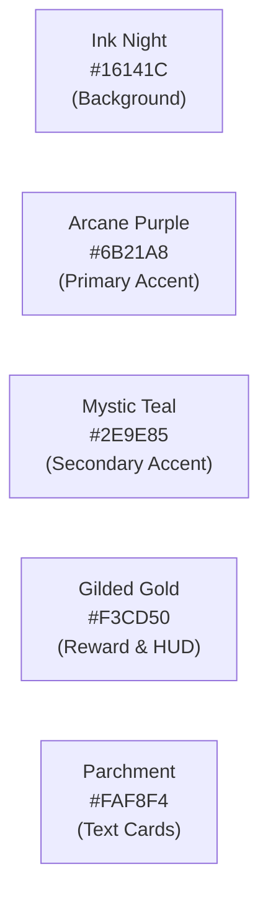

# Design System & UI Style Guidelines 🎨

> Design tokens, color palettes, typography specifications, UI container assets, and key asset locations for **MilleRace**.

---

## 🎨 Color Palette & Visual Theme

MilleRace uses a curated dark radial-gradient aesthetic rooted in fantasy, literature, and media literacy themes:

### Palette Tokens (`css/design-tokens.css`)

| Color Token | Hex / HSL | Semantic Role & Usage |
|---|---|---|
| `--color-bg-ink` | `#16141C` | Deep ink-night background for all screens and radial backdrop glows. |
| `--color-purple-primary` | `#6B21A8` | Arcane purple for brand buttons, stage banners, and card accent bands. |
| `--color-purple-light` | `#854EB4` | Lighter purple for badges, hover states, and glow shadows. |
| `--color-teal-mystic` | `#2E9E85` | Mystic teal for secondary highlights, university affiliation badges, and success chips. |
| `--color-gold-gilded` | `#F3CD50` | Gilded gold for timer digits, key badges, score glows, and active navbar indicators. |
| `--color-parchment` | `#FAF8F4` | Parchment cream for serif text bodies, paper container cards, and readable passage backgrounds. |
| `--color-border-glass` | `rgba(243, 205, 80, 0.15)` | Subtle golden-yellow border for glassmorphic cards and containers. |

---

## 🔤 Typography & Font Hierarchy

MilleRace combines three Google Fonts and local font fallbacks for distinct typographic roles:

| Font Family | Weight / Style | CSS Variable | Semantic Usage |
|---|---|---|---|
| **Cinzel** | Display Serif (700, 900) | `--font-display` | Main titles, hero headings (`h1`, `h2`), modal headers, and stage banners. |
| **Bona Nova** | Classical Serif (400, 700, italic) | `--font-body`, `--font-serif` | Narrative dialogues, story lore, passage reading text, character bios, and result certificates. |
| **Cutive Mono** | Monospace (400) | `--font-mono` | 3-minute HUD countdown timer, point counters, key indices, and data metrics. |

---

## 🖼️ UI Container & Component Assets

* **Stage 3 Text Container:** [`assets/images/ui/questions/level-3/Paper.svg`](../assets/images/ui/questions/level-3/Paper.svg) — Custom newspaper/paper frame background for textual AIAS evaluation.
* **Stage 4 Comprehension Container:** [`assets/images/ui/questions/level-4/Paper.svg`](../assets/images/ui/questions/level-4/Paper.svg) — Parchment container for high-order inferencing questions.
* **Result Score Badge & Glows:** [`assets/images/ui/result/`](../assets/images/ui/result/) — Vector assets including `Result-with-name.svg`, `YELLOW GOWING TITIK.svg`, `Group 20.svg`, and `Rectangle 80.svg`.
* **Stage Keys:** Vector keys #1 through #4 displayed in the upper HUD bar.

---

## 📁 Key Design & Asset File Locations

| Asset Category | Directory / File Path | Description |
|---|---|---|
| **Design Tokens** | [`css/design-tokens.css`](../css/design-tokens.css) | Core CSS custom properties (colors, typography, elevation, animations). |
| **Stage Stylesheets** | [`css/game-stages.css`](../css/game-stages.css) | Layouts and question container styles for Stages 1 to 4. |
| **Result Stylesheet** | [`css/result.css`](../css/result.css) | Serif scorecard styling, character hero cards, and recommendation toolkit. |
| **UI References** | [`docs/design-references/ui-references/`](design-references/ui-references/) | High-resolution UI captures and visual mockups. |
| **Brand Guidelines** | [`docs/design-references/brand-guidelines/`](design-references/brand-guidelines/) | Official brand styling notes, color swatches, and spacing guidelines. |
| **Figma CSS Exports** | [`docs/design-references/figma-css/`](design-references/figma-css/) | Raw Figma CSS dumps for component styling references. |
| **Question UI Assets** | [`assets/images/ui/questions/`](../assets/images/ui/questions/) | Level-specific SVG frames, paper textures, and choice containers. |
| **Character Stills** | [`assets/images/characters/stills/`](../assets/images/characters/stills/) | Transparent PNG portraits of Miller, Jen, Aidan, and Lizzy. |
| **Character Animations** | [`assets/images/characters/animations/`](../assets/images/characters/animations/) | Sprite animations for walk, jump, and dialogue states. |
| **Character Lore & Scripts** | [`docs/character-profiles.md`](character-profiles.md) | Original character dialogue quotes, reading links, and toolkits. |

---

[⬅️ Key Features](features.md) | [Next: Architecture & Tech Stack ➔](architecture-and-tech-stack.md)
