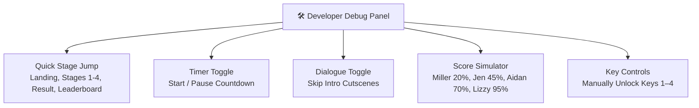

# Developer Guide & Verification 🛠️

> Instructions for local development, developer debug tools, automated testing, and CI/CD verification for **MilleRace**.

---

## 🚀 Getting Started

### Option 1: Direct Browser Launch
MilleRace is built with pure web standards. You can open `index.html` directly in modern web browsers:
```bash
# Windows
start index.html

# macOS
open index.html

# Linux
xdg-open index.html
```

### Option 2: Local HTTP Server (Node.js)
Start the built-in zero-dependency static server on `http://localhost:8080`:
```bash
npm start
```

### Option 3: Local HTTP Server (Python)
```bash
python -m http.server 8000
```
Then navigate to `http://localhost:8000` in your web browser.

---

## 🎛️ Developer Mode & Debug Controls

MilleRace includes an integrated Developer Debug Panel for rapid testing, presentations, and edge-case inspection:

### Keyboard Shortcuts
Press any of the following key combinations on any screen:
- `Ctrl + Shift + D`
- `Alt + D`
- `~` (Tilde)



### Developer Capabilities
* **Quick Jump:** Instantly navigate to any screen (`Landing`, `About Us`, `Our Team`, `Our Mission`, `Stage 1`, `Stage 2`, `Stage 3`, `Stage 4`, `Final Result`, `Leaderboard`).
* **Timer Toggle:** Pause the 3-minute relay countdown for stress-free inspection.
* **Skip Dialogues:** Bypass character typewriter introductions for rapid testing.
* **Score Simulator:** Simulate archetypes directly with mathematically balanced 20/40/20/20 distributions (Miller: 20 pts, Jen: 45 pts, Aidan: 70 pts, Lizzy: 95 pts).
* **Key Unlockers:** Manually toggle lock/unlock state for Keys 1 through 4.

---

## 🧪 Automated Testing & Playwright Verification

MilleRace utilizes **`playwright-core`** wired directly to the system-installed **Google Chrome** (`channel: 'chrome'`), eliminating heavy Chromium bundle downloads.

### 1. Prerequisites
Ensure you have **Node.js** (v18+) and **Google Chrome** installed.

Install development dependencies:
```bash
npm install
```

### 2. Test Commands

| Command | Description |
|---|---|
| `npm test` | Runs the full Playwright test suite headlessly in Google Chrome with automatic local web server lifecycle management. |
| `npm run verify` | Runs a standalone `playwright-core` diagnostic runner that boots the server, navigates to the app in Google Chrome, tests DOM nodes, and saves a verification screenshot. |
| `npm run test:chrome` | Explicitly targets the Google Chrome browser configuration. |
| `npm run test:ui` | Opens interactive Playwright UI mode for time-travel debugging and DOM inspection. |

---

## 🚢 Deployment & CI/CD

For comprehensive deployment instructions, Edge CDN caching strategies, and environment secret setup, consult the dedicated [Deployment-Plan.md](../Deployment-Plan.md).

* **Edge CDN Hosting:** Configured via `vercel.json` with immutable asset caching and HTTP security headers.
* **GitHub Actions Workflow:** `.github/workflows/deploy.yml` runs automated pre-flight file checks, injects production Firebase configuration, and deploys directly to Vercel on push to `main`.

---

[⬅️ Product Requirement Document](prd.md) | [Next: Automated Testing & Verification ➔](testing.md)
