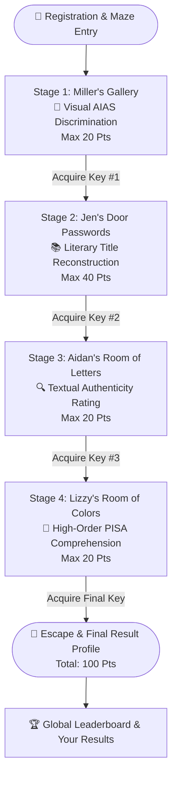

# The 4-Stage Relay Journey 🗺️

> Walkthrough of the gameplay flow, stage mechanics, puzzle structures, narrative settings, and key unlock conditions in **MilleRace**.

---

## 🏁 Gameplay Loop Overview

Racers enter the digital maze against a shared **3-minute countdown timer**. The timer pauses during narrative dialogue interactions with each stage guardian, allowing players to absorb character lore without time penalty.

---

## 🎨 Stage 1 — Miller's Visual AIAS Gallery

* **Stage Guardian:** Miller
* **Setting:** A warm-toned, classical art gallery lined with framed masterworks and synthetic impostors.
* **Challenge Format:** Multiple-choice AI decoy elimination.
* **Task:** Spot prompt artifacts, spatial anomalies, and synthetic symmetry to eliminate the AI-generated decoy paintings across 4 distinct artistic questions.
* **Competencies Tested:** AIAS Visual parameters (Symmetry, Expressionalism, Distinctions, Proportionality, Memorability).
* **Scoring:** 4 questions $\times$ 5 points = **20 points maximum**.
* **Stage Reward:** 🔑 **Key #1** — *"Observant eyes spot the algorithm's flaws!"*

---

## 📚 Stage 2 — Jen's Door Passwords

* **Stage Guardian:** Jen
* **Setting:** A playground wonderland labyrinth with locked brass and wrought-iron doors.
* **Challenge Format:** Fill-in-the-blank literary reconstruction.
* **Task:** Restore 10 classic and contemporary book titles (*Anne of Green Gables*, *The Kite Runner*, *Norwegian Wood*, *Little Women*, etc.) by selecting the missing literary keyword.
* **Competencies Tested:** Breadth of literary exposure, title recognition, and vocabulary retrieval.
* **Scoring:** 10 questions $\times$ 4 points = **40 points maximum**.
* **Stage Reward:** 🔑 **Key #2** — *"Old ways won't open new doors!"*

---

## 🔍 Stage 3 — Aidan's Room of Letters

* **Stage Guardian:** Aidan
* **Setting:** A quiet chamber floored with archival newspapers and illuminated by hanging key mobiles.
* **Challenge Format:** 4-point graduated textual authenticity rating (`Human`, `Somewhat Human`, `Barely Human`, `Not Human`).
* **Task:** Read 5 short narrative and informative text passages and classify their origin on the graduated scale.
* **Competencies Tested:** Subtle lexical choices, narrative consistency, logical flow, and AI hallucination detection.
* **Scoring:** Graduated point distribution (up to 5 points per passage; capped at **20 points maximum**).
* **Stage Reward:** 🔑 **Key #3** — *"You've been reading! The clues are in the prose!"*

---

## 🧠 Stage 4 — Lizzy's Room of Colors

* **Stage Guardian:** Lizzy
* **Setting:** A surreal, vibrant hall filled with floating illuminated books and glowing inkwells.
* **Challenge Format:** High-order inferential comprehension multiple-choice questions with weighted scoring.
* **Task:** Read complex literary excerpts and answer 4 nuanced inferential questions that require synthesizing tone, subtext, and thematic intent.
* **Competencies Tested:** PISA Level 5–6 critical inferencing, meta-cognition, authorial bias evaluation.
* **Scoring:** Weighted points (0, 3, or 5 points per question) across 4 questions = **20 points maximum**.
* **Stage Reward:** 🗝️ **The Final Key & Maze Exit**.

---

## 🎉 The Escape & Result Profile

Upon completing Stage 4:
1. The player unlocks the maze exit door.
2. The game calculates the cumulative score ($0 \dots 100$) and maps the player to their **Pedagogical Character Archetype**.
3. Real-time leaderboard placement is computed.
4. Actionable, personalized reading and critical thinking recommendations are unlocked.

---

[⬅️ Theoretical Frameworks](theoretical-frameworks.md) | [Next: Point System & Scoring Matrix ➔](scoring-system.md)
