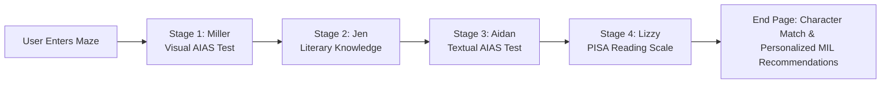
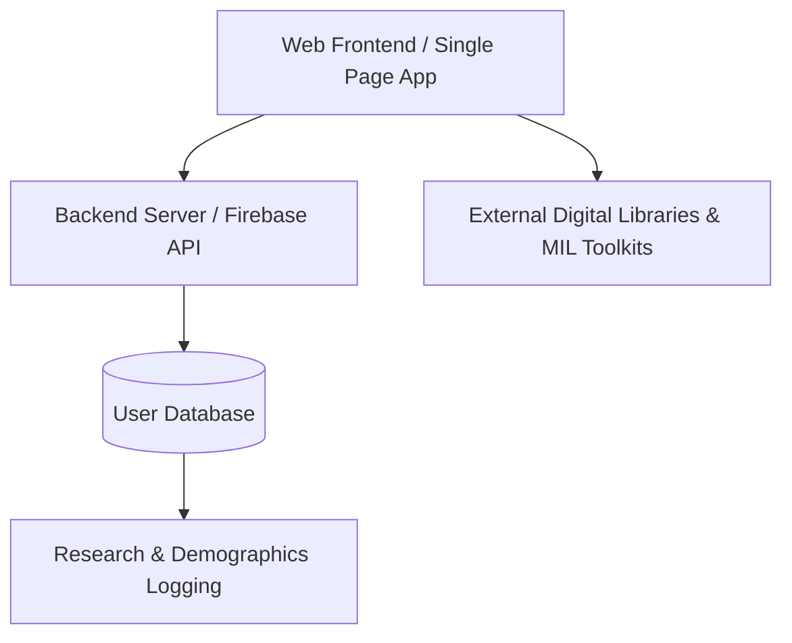
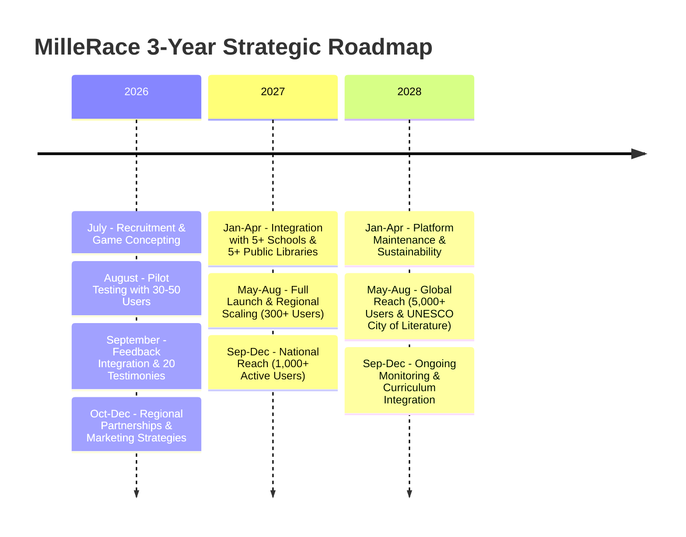

# Product Requirement Document (PRD)
## MilleRace: Gamified Media and Information Literacy (MIL) Web Game

**Document Version:** 1.0.0  
**Project Lead:** Mulawarman University Team (East Kalimantan, Indonesia)  
**Target Event:** UNESCO Youth Hackathon 2026  
**Theme Alignment:** "Play Your Part" | *Sub-Theme:* "Youth Designing the Future of Media Information and Literacy"  
**Status:** Alpha / Baseline Specification  

---

## 1. Executive Summary

**MilleRace** is an immersive web-based relay race game designed to test, educate, and elevate Media and Information Literacy (MIL) among readers of varying age groups (adolescents to adults). Set within a magical maze styled after an interactive art commonplace, users partner with four distinct characters—**Miller**, **Jen**, **Aidan**, and **Lizzy**—to solve tasks involving AI-generated art identification, literary recognition, text discrimination, and reading comprehension under a 3-minute timer.

By combining the **Artificial Intelligence Assessment Scale (AIAS)** with the **PISA Reading Scale** (Levels 1–6) and **CEFR Standards** (A1–C1), MilleRace provides users with a personality-quiz style result at the end of the race. The game yields a character compatibility match along with customized, actionable recommendations for local public library resources, curated books, and critical thinking toolkits.

---

## 2. Background & Problem Statement

### 2.1 The Indonesian Literacy Paradox
According to data from Badan Pusat Statistik (2024), only 14 out of 34 Indonesian provinces have established public libraries providing accessible sample data. Operational hours are limited (averaging 6 hours/day), and libraries often depend on secondhand book donations, outdated research papers, and old archives. Consequently, official statistics show an average Indonesian borrows only 2 literacy items per year, contributing to low rankings on the triennial Programme for International Student Assessment (PISA) tests (2015, 2018, 2022).

However, alternative reading metrics reveal latent interest: seasonal book festivals (e.g., *Semesta Buku by Gramedia 2026* and *Big Bad Wolf 2025*) saw a 46% surge in customer attendance and sold over 5 million newly published books. This highlights that access and distribution—rather than lack of interest—are primary bottlenecks.

### 2.2 The Rise of Generative AI & Digital Misinformation
Digitalized news platforms, recommendation algorithms, and Generative Artificial Intelligence (AI) present new challenges:
1. **AI Art & Copyright Issues:** Generative model replication of artist styles (e.g., Studio Ghibli artwork controversies) blurs the line between human-made art and AI prompt outputs.
2. **Textual Misinformation & Synthetic Content:** Machine Learning (ML) and Natural Language Processing (NLP) models produce convincing synthetic text that lacks human common sense and ethical context (UNESCO MIL Framework 2024; Stiglitz 2025).

---

## 3. Product Vision & Strategic Objectives

MilleRace transforms standardized literacy assessment into an engaging, non-punitive digital relay race.

### Core Objectives
1. **Gamify Standardized MIL Testing:** Adapt PISA, Cambridge, and TOEFL ITP test structures into a 3-minute timed game loop.
2. **Raise AI Awareness:** Utilize the Artificial Intelligence Assessment Scale (AIAS) to teach users how to spot AI-generated visual art and synthetic text.
3. **Bridge Local & Digital Library Access:** Connect post-game recommendations directly to Indonesian public libraries (e.g., Perpustakaan Nasional Digital, Bank Indonesia libraries) and open digital repositories (Project Gutenberg, Internet Archive).
4. **Promote Graded Reading:** Match user reading proficiency to tailored book recommendations and habits without punitive grading.
5. **Mitigate Misinformation:** Train users in fact-checking, citation verification, and data/graphic literacy.

---

## 4. Theoretical & Matriculation Frameworks

### 4.1 Artificial Intelligence Assessment Scale (AIAS)
Applied in Stages 1 & 3 to distinguish AI-generated content from human creations across 5 parameters:
- **Symmetry:** Evaluating unnatural geometric perfection or structural misalignments.
- **Expressionalism:** Assessing emotional depth vs. robotic surface imagery.
- **Distinctions:** Identifying unique human stylistic quirks vs. generic algorithmic patterns.
- **Proportionality:** Spotting anatomical or spatial discrepancies in images/text.
- **Memorability:** Distinguishing original narrative concepts from repetitive AI prompt vocabulary.

### 4.2 Reading Scale & Metric Baseline
- **PISA Reading Scale (Levels 1–6):** Level 1 (subdivided baseline classification) to Level 6 (evaluating complex misinformation and nuanced inferences).
- **CEFR Standards:** A1 to C1 scale integration.

---

## 5. Target Audience & User Demographic

Initial prototype testing targets 30–50 beta users across three key demographics:

| Demographic | Age Group | Target Sample | Predicted CEFR | Predicted PISA Level |
|---|---|---|---|---|
| **Early Readers** | 6–12 years | 10 users | A1–A2 | Level 1–2 |
| **Young Adults** | 13–17 years | 10 users | B1 | Level 3–4 |
| **Advanced Readers** | 18+ years | 10 users | B2–C1 | Level 5–6 |

---

## 6. Character Profiles & Scoring Mapping

Users accumulate points across all 4 stages (0–100 points total). At the end of the race, users match with one of four character archetypes based on their final score:

```mermaid
gantt
    title MilleRace Score Thresholds & Character Match
    dateFormat X
    axisFormat %s pts
    section Miller
    1 - 25 pts (Level 1-2 PISA / A1-A2 CEFR) : 0, 25
    section Jen
    26 - 50 pts (Level 3-4 PISA / B1 CEFR) : 25, 50
    section Aidan
    51 - 75 pts (Level 5 PISA / B2 CEFR) : 50, 75
    section Lizzy
    76 - 100 pts (Level 6 PISA / C1 CEFR) : 75, 100
```

### 6.1 Miller
- **Point Range:** 1–25 Points
- **Proficiency Level:** PISA Reading Level 1–2 | CEFR A1–A2 (Early Reader)
- **Character Bio:** Curious and ready for new chapters! Miller loves finding clues for his adventures, but often gets lost without his keys. He would love to read more, one page at a time. Comic books and fun facts suit his personality.
- **Front-End Quote:** *"Miller loves finding clues for his adventures! But he often gets lost without his keys. That is why thinking critically is important!"*
- **Recommended Home Activities:** Nighttime stories, comic books, fun facts from encyclopedias, crosswords.
- **Recommended Book List:**
  1. *Charlotte's Web* by E. B. White ([Internet Archive](https://archive.org/details/CharlottesWeb))
  2. *Keluarga Cemara* by Arswendo Atmowiloto ([Perpustakaan Nasional Digital](https://kios-perpustakaan.jakarta.go.id/catalogue/detail/99218))
- **Critical Thinking Resources:**
  1. [University of Sheffield Critical Thinking Guide](https://sheffield.ac.uk/study-skills/research/approaches/thinking-critically)
  2. [Bookrclass Critical Thinking Activities for Kids](https://bookrclass.com/blog/critical-thinking-activities-for-kids/)

### 6.2 Jen
- **Point Range:** 26–50 Points
- **Proficiency Level:** PISA Reading Level 3–4 | CEFR B1 (Young Adult)
- **Character Bio:** Witty and energetic, Jen is exploring the world! She has imaginary friends and places to be. Short stories and fairy tales are where she goes, inspired by real-life stories and writing in her diary.
- **Front-End Quote:** *"Jen knows everything! But she never really knows what to trust. She always checks… factually!"*
- **Recommended Home Activities:** Reading short stories, keeping journal/diary logs, completing fact-check courses.
- **Recommended Book List:**
  1. *The Fault in Our Stars* by John Green ([Google Books](https://books.google.co.id/books/about/The_Fault_in_Our_Stars.html?hl=id&id=Qk8n0olOX5MC&redir_esc=y))
  2. *Laskar Pelangi* by Andrea Hirata (Available in digitized local library services)
- **Fact-Checking Resources:**
  1. [Reuters Fact-Check Guide](https://www.reuters.com/fact-check/)
  2. [MediaSmarts Break the Fake Online Scavenger Hunt](https://mediasmarts.ca/break-fake)

### 6.3 Aidan
- **Point Range:** 51–75 Points
- **Proficiency Level:** PISA Reading Level 5 | CEFR B2 (Advanced Reader)
- **Character Bio:** Adventurous and resilient, Aidan is on the move! Books are his window to the world. He reads articles about his favorite characters, loves book series, and watches film adaptations.
- **Front-End Quote:** *"Aidan loves browsing the internet! But he only accepts legit sources. He sees citations and timelines!"*
- **Recommended Home Activities:** Reading book series, watching film adaptations, mastering academic citations and references.
- **Recommended Book List:**
  1. *1984* by George Orwell ([Internet Archive PDF](https://dn790002.ca.archive.org/0/items/NineteenEightyFour-Novel-GeorgeOrwell/orwell1984.pdf))
  2. *Gadis Kretek* by Ratih Kumala (Available in Bank Indonesia regional libraries)
- **Citation Resources:**
  1. [PSU Library Bibliometrics & Citation Searching Guide](https://guides.libraries.psu.edu/bibliometrics/citationsearching)
  2. [Kichu Josef's Article on Academic References & Citations](https://medium.com/@kichu.josef/all-you-need-to-know-about-references-citations-in-academic-writing-9174922d5f9e)

### 6.4 Lizzy
- **Point Range:** 76–100 Points
- **Proficiency Level:** PISA Reading Level 6 | CEFR C1 (High Literacy / Wiz)
- **Character Bio:** Lizzy is the wiz! She reads like there's no tomorrow and is always guarded against misinformation. She creates artwork based on what she reads and reads graphs like Egyptian pyramids.
- **Front-End Quote:** *"Lizzy's lies set on lies! She reads graphs like the Egyptian pyramid. Statistics got nothing on her!"*
- **Recommended Home Activities:** Volunteering in local reading clubs/communities, creating literature-inspired artwork, studying data and graphic literacy.
- **Recommended Book List:**
  1. *The Strange Case of Dr Jekyll and Mr Hyde* by Robert Louis Stevenson ([Project Gutenberg](https://www.gutenberg.org/files/43/43-h/43-h.htm))
  2. *Bumi Manusia* by Pramoedya Ananta Toer (Available in local library services)
- **Data Literacy Resources:**
  1. [UC Berkeley Beginner's Guide to Reading Graphics](https://ischoolonline.berkeley.edu/blog/beginners-guide-improving-data-literacy/)
  2. [Dataversity Data Literacy Essentials](https://www.dataversity.net/articles/data-literacy-essentials-what-you-need-to-know/)

---

## 7. End-to-End User Journey Map (Steps A to P)

| Step | Screen / Stage | User Action & System Response | UX & Audio Visual Cue |
|---|---|---|---|
| **A** | Browsing | User accesses `mille-race` web domain on mobile/desktop. | Clean, responsive landing screen. |
| **B** | Instructions & Intro | User scrolls down to view game instructions and lore context. | Warm-toned, crayon-styled art overview. |
| **C** | Registration Landing | User inputs nickname and age into data collection modal. | Clean form submission for analytics DB. |
| **D** | Character Intro: Miller | Miller greets user via dialogue text box, establishing maze lore. | Starry ambience, warm-toned lighting. |
| **E** | Stage 1 (Game 1) | User identifies human artwork vs. AI-generated decoys (6 items). | Gallery room setting; 3-min timer. |
| **F** | Stage 1 Clear | System awards Key #1, tallies temporary points, triggers transition. | Character transformation animation. |
| **G** | Character Intro: Jen | Jen greets user and introduces the door password challenge. | Wonderland playground interior cue. |
| **H** | Stage 2 (Game 2) | User fills in missing words for 10 famous book titles. | Interactive keyboard / door selection. |
| **I** | Stage 2 Clear | Key #2 obtained; "Old ways won't open new doors!"; points added. | Key unlock sound & transformation. |
| **J** | Character Intro: Aidan | Aidan welcomes user to the Room of Letters & Keys. | Room with newspaper floors & hanging keys. |
| **K** | Stage 3 (Game 3) | User evaluates 5 text passages to identify AI vs Human writing. | 4-option rating scale ([Human]..[Not Human]). |
| **L** | Stage 3 Clear | Key #3 obtained; points updated. | Transformation sequence. |
| **M** | Character Intro: Lizzy | Lizzy greets user in the Room of Bursting Colors. | Vibrant, colorful library illustration. |
| **N** | Stage 4 (Game 4) | User answers 4 reading comprehension & inferential questions. | Weighted options (0, 3, or 5 points). |
| **O** | Stage 4 Clear | Final Key unlocked; player completes the maze. | Door unlocking graphic & loading screen. |
| **P** | Results End Page | System calculates total score, reveals matched character profile. | Interactive slideshow with books & MIL links. |

---

## 8. Detailed Gameplay Specifications (Stages 1–4)

### 8.1 Stage 1: Miller's Gallery (Visual Art AIAS Test)
- **Setting:** Warm-toned art gallery with framed paintings.
- **Lore Dialogue:** *"Each room in this building is interlocked. To reach the end of the maze, we must obtain keys. The first one is hidden in the gallery. We must first clear up the space and find it. Eliminate decoys and help me find real art works."*
- **Timer:** 3 Minutes countdown (`03:00`).
- **Questions Specification:**
  - **Q1:** Image set. **Correct Answer: B** (*A: Woman with Her Parasol by Claude Monet, C: The Swing by Jean-Honore Fragonard*).
  - **Q2:** Image set. **Correct Answer: C** (*A: The Yellow Wallpaper by Charlotte Perkins Gilman, B: The Metamorphosis by Franz Kafka*).
  - **Q3:** Image set. **Correct Answer: C** (*A: NASA Hubble Collections, B: NASA Webb Collections*).
  - **Q4:** Image set. **Correct Answer: A**.
  - **Q5:** Chaelint's original hand drawing vs 2 AI-generated pictures.
  - **Q6:** Additional Chaelint drawing vs 2 AI-generated pictures.
- **Clear Condition:** Key #1 Obtained. Temporary points accumulated. Miller transforms into the next character.

### 8.2 Stage 2: Jen's Door Passwords (Literary General Knowledge)
- **Setting:** Wonderland, playground-style interior with colorful interlocked doors.
- **Lore Dialogue:** *"There are too many doors to unlock. Only one way to find out. Each of these doors contain a password. Fill in the blanks with the correct options."*
- **Gameplay Mechanics:** 10 fill-in-the-blank book title puzzles.
- **Questions & Correct Answers:**
  1. Anne of Green **[Gables]**
  2. Harry Potter and The **[Order]** of The Phoenix
  3. The **[Kite]** Runner
  4. Gulliver's **[Travels]**
  5. **[Norwegian]** Wood
  6. The Lion, The Witch & The **[Wardrobe]**
  7. The **[Fault]** in Our Stars
  8. My Year of **[Rest]** and Relaxation
  9. Song of The Open **[Road]**
  10. A Brief History of **[Time]**
- **Clear Dialogue:** *"You got it! Old ways won't open new doors! Congratulations for your key!"*
- **Clear Condition:** Key #2 Obtained. Jen transforms into Aidan.

### 8.3 Stage 3: Aidan's Floor of Letters (Textual AIAS Test)
- **Setting:** Room with floors covered in newspaper text and hanging key mobiles.
- **Lore Dialogue:** *"Ah, if this isn't the key to success... I figure these letters have clues to our next key. Help me delete letters that do not sound human."*
- **Gameplay Mechanics:** User evaluates 5 text passages and classifies them under: `[Human]`, `[Somewhat Human]`, `[Barely Human]`, or `[Not Human]`.
- **Text Content Matrix:**
  - **Text 1:** *"Axolotls derive from the same species as salamanders. Whilst being amphibians, their external gills remain aquatic. They reach maturity without significant metamorphosis."*  
    -> **Target Classification:** `[Human]`
  - **Text 2:** *"British foods revolve around proteins. A full-on English breakfast have fried egg, bacons, beans and Yorkshire pudding. For lunch, scotched eggs are a common favorite, in a donut shape with breaded sausage."*  
    -> **Target Classification:** `[Somewhat Human]` *(AI grammatical flaws/odd phrasing)*
  - **Text 3:** *"Valentine's Day is celebrated every February 14th and is named after Saint Valentine, a Roman priest associated with love and romance. People around the world celebrate their love by exchanging billions of chocolates, flowers, and cards with their loved ones."*  
    -> **Target Classification:** `[Not Human]` *(Generic AI synthesis)*
  - **Text 4:** *"In the 1920s, uniforms were often formal and practical, reflecting the fashion and social standards of the time. Many people wore uniforms for work, school, sports, and military service, and these outfits were usually designed to look neat and professional. Uniforms from this era often included structured jackets, skirts or trousers, hats, and polished shoes."*  
    -> **Target Classification:** `[Not Human]` *(Algorithmic text template)*
  - **Text 5:** *"Chopsticks are made around 1200 BCE. Historically, firework became on demand during the Shang dynasty where people had to work quickly. The utensil is made to shorten time when chopping and stirring."*  
    -> **Target Classification:** `[Human]`
- **Clear Condition:** Key #3 Obtained. Dialogue: *"I see you've been reading! You might be the key player. The end of the maze is near!"* Aidan transforms into Lizzy.

### 8.4 Stage 4: Lizzy's Bursting Room (PISA Reading & Inferential Comprehension)
- **Setting:** Surreal room bursting with vibrant colors, flying letters, and books.
- **Lore Dialogue:** *"This place is bursting its colors! We must escape quickly before it lures us into magic!"*
- **Gameplay Mechanics:** 4 reading comprehension questions with weighted point allocations based on inference quality.
- **Question Matrix:**
  1. *Charlie searches for the Golden Ticket on the edge of a gutter. It has been his only wish, but he could not afford an expensive bar of Wonka chocolate.*  
     - A. The Golden Ticket is hidden in a bar of Wonka chocolate **(3 pts)**
     - B. Charlie comes from a poor family **(5 pts - Highest Inference)**
     - C. A Wonka chocolate bar comes in limited edition **(0 pts)**
  2. *Mrs Honey's house is the only place where Matilda can read freely. At home, her parents think of it as bizarre; they would be on tantrums.*  
     - A. Mrs Honey is a relative of Matilda's **(0 pts)**
     - B. Matilda's parents do not share her intelligence **(5 pts - Highest Inference)**
     - C. Matilda performs above average at school **(3 pts)**
  3. *There has been discourses on the IELTS test. Some say it is a form of discrimination to third world countries as the certification expires in two years. It is studied in the theory of Postcolonialism.*  
     - A. The IELTS exam is in the expensive side **(0 pts)**
     - B. One person's English language skill is seen as interchangeable **(3 pts)**
     - C. The study of Postcolonialism studies power dominance between countries **(5 pts - Highest Inference)**
  4. *Gastrodiplomacy presents itself in food similarities. For example, Mexican elotes and Indonesian jagung susu keju share the same concept of shredded corn with cheese as dessert.*  
     - A. Gastrodiplomacy connects countries through culinary knowledge **(5 pts - Highest Inference)**
     - B. Mexican foods share similar culture to Indonesian foods **(0 pts)**
     - C. Gastrodiplomacy means food similarities **(0 pts)**
- **Clear Condition:** Final Key unlocked. Door unlocks. Loading screen transitions to Test Results Page.

---

## 9. Non-Functional & Technical Architecture

### 9.1 Frontend & UX Specifications
- **Technology Stack:** HTML5, CSS3 (Vanilla custom styling), JavaScript (ES6+ Single Page Application pattern).
- **Art Direction:** Warm-toned lighting, starry ambience, crayon-styled illustrations.
- **Responsive Layout:** Fluid adaptation across mobile browsers (smartphones) and desktop screens.
- **Timer Engine:** Shared 3-minute (`180 seconds`) countdown component per stage.

### 9.2 Data Collection & Privacy
- User inputs preferred **nickname** and **age group** on the landing page.
- Data logged securely for educational research and demographic analytics without storing sensitive PII (Personally Identifiable Information).

---

## 10. Project Implementation Roadmap (3-Year Plan)

### 10.1 Year 1 (2026): Foundation & Pilot Validation
- **July 2026:** Team recruitment, scriptwriting, animation, UI/UX prototyping, web development.
- **August 2026:** Alpha testing (August 5th) and Beta launch (August 11th) targeting 30–50 users (10 primary/middle school, 10 high school/varsity).
- **September 2026:** Feedback integration and collecting 20 user testimonies across A1–C1 levels.
- **October–December 2026:** Marketing strategy rollout (User-Generated Content, School Tours, Door-to-Door), partnerships, sponsorship acquisition.

### 10.2 Year 2 (2027): Regional Scaling (East Kalimantan focus)
- **January–April 2027:** Partnerships with 5+ formal/cram schools and 5+ public libraries across East Kalimantan.
- **May–August 2027:** Official public launch, outreach to 3+ bookstores, 4+ reading clubs, 7+ literary festivals. Target: 300+ active users.
- **September–December 2027:** Web maintenance, expansion to 10+ educational foundations and 10+ literary communities. Target: 1,000+ active users.

### 10.3 Year 3 (2028): National & Global Outreach
- **January–April 2028:** Web optimization and feedback integration based on 1,000+ users.
- **May–August 2028:** International campaigns partnering with **UNESCO City of Literature** and **UNESCO Silk Road Magazines**. Target: 5,000+ users.
- **September–December 2028:** Full integration into national educational extracurriculars and continuous platform monitoring.

---

## 11. Financial Projections & Budget Breakdown

All figures are presented in USD ($).

### 11.1 Technology & Infrastructure
| Item | Unit Price | Duration / Qty | Annual Total | 3-Year Total |
|---|---|---|---|---|
| Web Domain | $11.21 / Year | 3 Years | $11.21 | $33.63 |
| Web Hosting / Cloud Server | $84.00 / Year | 3 Years | $84.00 | $252.00 |
| Database / API Integration | $56.00 / Year | 3 Years | $56.00 | $168.00 |
| Asset & Plugin Licenses | $44.85 / Year | 3 Years | $44.85 | $134.55 |
| **Subtotal** | | | **$196.00** | **$785.00** |

### 11.2 Content & Creative Production
| Item | Unit Price | Duration / Qty | Annual Total | 3-Year Total |
|---|---|---|---|---|
| Character Design & Animation Assets | $112.00 / Year | 3 Years | $112.00 | $336.00 |
| UI/UX Prototyping Tools & Web Assets | $28.00 / Year | 3 Years | $28.00 | $84.00 |
| Post-Production | $56.00 / Year | 3 Years | $56.00 | $168.00 |
| **Subtotal** | | | **$196.00** | **$588.00** |

### 11.3 Pilot Testing & Community Engagement
| Item | Unit Price | Duration / Qty | Annual Total | 3-Year Total |
|---|---|---|---|---|
| Beta Tester Incentives / Rewards | $84.00 / Year | 3 Years | $84.00 | $252.00 |
| Offline Workshop & Public Library Engagement | $112.00 / Year | 3 Years | $112.00 | $336.00 |
| Printable MIL Toolkits for Schools | $56.00 / Year | 3 Years | $56.00 | $168.00 |
| **Subtotal** | | | **$252.00** | **$756.00** |

### 11.4 Marketing & Operations
| Item | Unit Price | Duration / Qty | Annual Total | 3-Year Total |
|---|---|---|---|---|
| Campaigns & User Acquisition | $84.00 / Year | 3 Years | $84.00 | $252.00 |
| Team Operational Expenses | $56.00 / Year | 3 Years | $56.00 | $168.00 |
| Contingency Fund | $56.00 / Year | 3 Years | $56.00 | $168.00 |
| **Subtotal** | | | **$196.00** | **$588.00** |

### 11.5 Budget Summary
- **Year 1 Grand Total:** **$840.00 USD**
- **3-Year Grand Total:** **$2,520.00 USD**

---

## 12. Project Team & Governance Structure

Developed by six students from **Mulawarman University**, Samarinda, East Kalimantan, Indonesia:

1. **Syahna Maryam** — *Project Manager 1, Scriptwriter, UX Writer, Character Designer & Researcher* (Senior-year, English Literature).
2. **Chairil Aminullah** — *Project Manager 2, Creative Director, UI/UX Designer & Marketer* (Junior-year, English Literature).
3. **Syema Chaelint Joshepine Karundaeng** — *Illustrator, Animator, Motion Graphic Artist & Visual Artist* (Junior-year, International Relations).
4. **Fazri Rahmad Nor Gading** — *Lead Software Engineer & Full-Stack Developer* (Penultimate, Computer Science).
5. **Muhammad Farrel Sirah** — *Game Logic & Project Planner* (Senior-year, Computer Science).
6. **Muhammad Fahrezy Al Faris** — *Researcher, Pitch Presenter & Report Writer* (Senior-year, International Relations).

---

## 13. Risk Management & Feasibility

| Risk Category | Risk Impact | Mitigation Strategy |
|---|---|---|
| **Low English Proficiency in Beta Users** | Moderate | Include visual cues, translation tooltips, and non-punitive character matching to encourage growth rather than test anxiety. |
| **Limited Regional Library Infrastructure** | High | Integrate direct links to open digital archives (*Project Gutenberg*, *Internet Archive*, *Perpustakaan Nasional Digital*) so users can read recommended titles immediately. |
| **Rapid Evolution of AI Generators** | High | Continuously update AIAS sample database in Stage 1 & Stage 3 with newly generated AI artwork/text patterns. |
| **User Engagement Retention** | Moderate | Introduce school tour events, community reading challenges, and shareable social media personality badges. |

---

*End of Product Requirement Document.*
