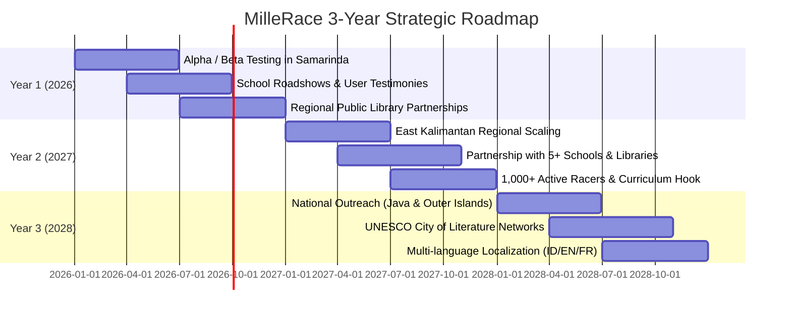

# 3-Year Strategic Roadmap (2026 – 2028) 📅

> Long-term scaling vision, institutional integration milestones, and community outreach plans for **MilleRace**.

---

## 🗺️ Roadmap Overview

---

## 📍 Phase Details

### 1. Year 1 (2026) — Foundation & Pilot Validation
* **Pilot Program:** Alpha/Beta testing with 30–50 regional students in Samarinda, East Kalimantan.
* **School Roadshows:** Interactive literacy workshops demonstrating AI discrimination and PISA reading skills.
* **Community Partnerships:** Integration with local library reading initiatives, youth book clubs, and cultural festivals.
* **Feedback Loop:** Iterative refinement of question banks, difficulty pacing, and user feedback mechanisms.

---

### 2. Year 2 (2027) — Regional Scaling across East Kalimantan
* **Institutional Adoption:** Formal partnerships with 5+ secondary schools and 5+ municipal libraries across East Kalimantan.
* **Scale Target:** Onboard 1,000+ active youth racers across the province.
* **Curriculum Integration:** Developing companion educator guides for Media and Information Literacy (MIL) classroom adoption.
* **Regional Competitions:** Hosting inter-school MIL relay race tournaments with local public library sponsors.

---

### 3. Year 3 (2028) — National & Global Outreach
* **National Expansion:** Scaling across Indonesian provinces in collaboration with national digital library networks (Perpusnas).
* **Internationalization:** Multi-language support (English, Indonesian, French) and alignment with UNESCO City of Literature networks.
* **Platform Evolution:** Expanding the question matrix with crowdsourced, educator-verified puzzle submissions and teacher dashboard analytics.

---

[⬅️ Architecture & Tech Stack](architecture-and-tech-stack.md) | [Next: Product Requirement Document ➔](prd.md)
