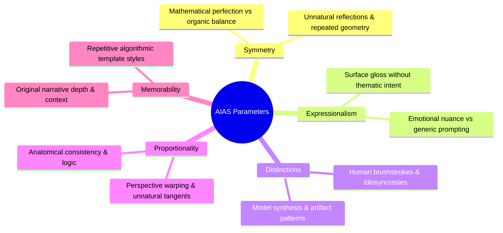
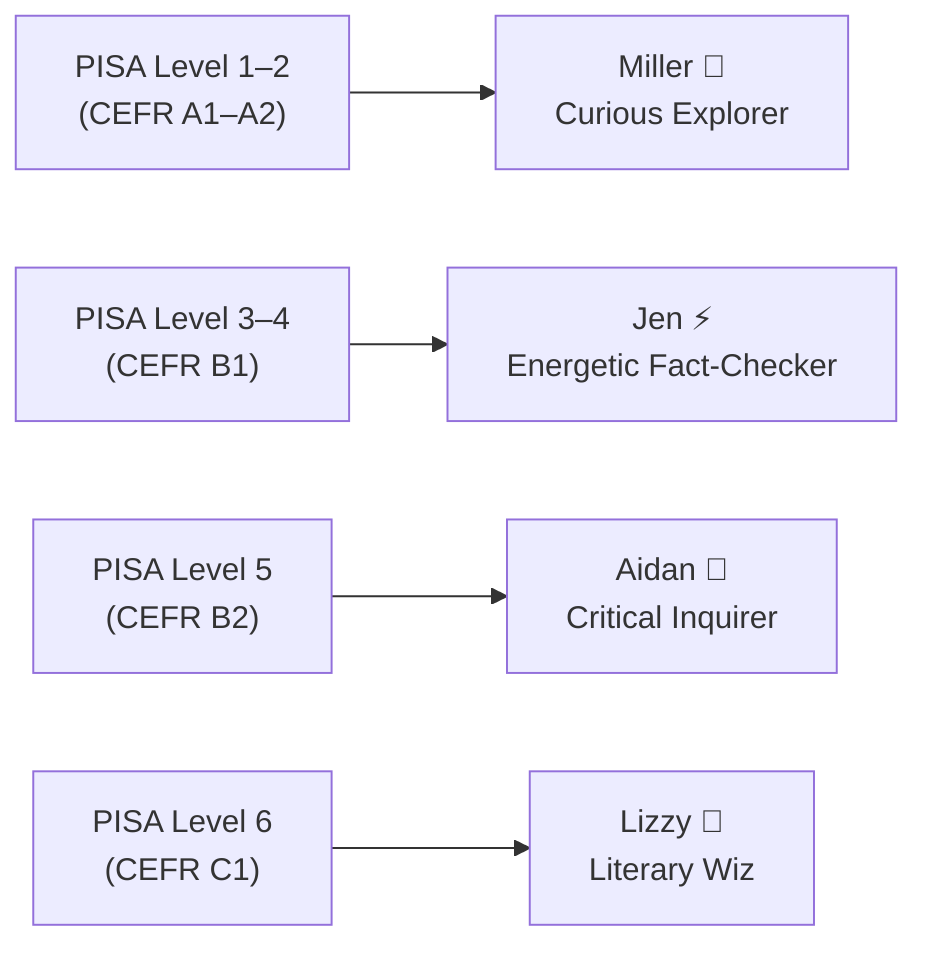

# Theoretical Frameworks 📐

> The foundational assessment and pedagogical standards integrated into the **MilleRace** game engine.

---

## 1. Artificial Intelligence Assessment Scale (AIAS)

The **Artificial Intelligence Assessment Scale (AIAS)** is applied in **Stage 1 (Visual AIAS)** and **Stage 3 (Textual AIAS)** to assess content authenticity across 5 core dimensions:

### The 5 AIAS Parameters

| Parameter | Focus | What to Look For |
|---|---|---|
| **1. Symmetry** | Geometric and spatial balance | Unnatural mathematical perfection or mirror-like flaws vs. natural organic irregularity. |
| **2. Expressionalism** | Emotional depth and authorial intent | Subtle human micro-expressions and thematic context vs. bland, generic aesthetic gloss. |
| **3. Distinctions** | Texture, medium, and brush technique | Authentic material grain, deliberate strokes, and imperfections vs. algorithmic blending artifacts. |
| **4. Proportionality** | Spatial logic and anatomical accuracy | Correct perspective vanishing points, finger/limb anatomy, and lighting consistency vs. synthetic anomalies. |
| **5. Memorability** | Conceptual originality | Novel conceptual storytelling vs. clichés generated from over-represented training tokens. |

---

## 2. PISA Reading Framework & CEFR Standards

Rather than applying stressful, punitive grading, MilleRace maps performance into non-punitive character archetypes across **PISA (Programme for International Student Assessment)** reading levels and **CEFR (Common European Framework of Reference for Languages)** proficiencies.

### Proficiency Matrix

| Framework Level | Core Competency | MilleRace Character | Pedagogical Objective |
|---|---|---|---|
| **PISA Level 1–2**   *(CEFR A1–A2)* | Locates explicit information, identifies basic themes, and recognizes literal connections. | **Miller** | Build reading confidence through visual clues, comic books, short mysteries, and curiosity-driven discovery. |
| **PISA Level 3–4**   *(CEFR B1)* | Identifies main ideas, integrates multi-part textual information, and makes basic inferences. | **Jen** | Develop daily reading routines, structured journaling, and simple fact-checking habits. |
| **PISA Level 5**   *(CEFR B2)* | Interprets nuanced nuances, evaluates conflicting perspectives, and navigates complex narrative structures. | **Aidan** | Refine source citation verification, comparative textual analysis, and timeline-based research skills. |
| **PISA Level 6**   *(CEFR C1)* | Deep inferential comprehension, meta-cognitive synthesis, and critical evaluation of bias & rhetoric. | **Lizzy** | Engage with scholarly articles, data visualization critique, and creative synthesis combating disinformation. |

---

[⬅️ Back to README](../README.md) | [Next: The 4-Stage Relay Journey ➔](gameplay-and-stages.md)
