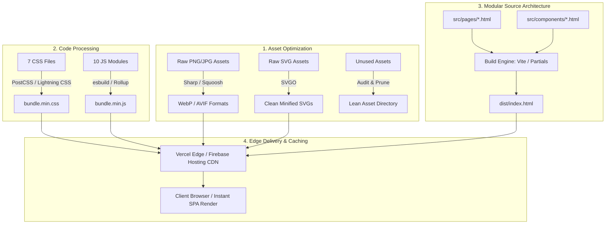
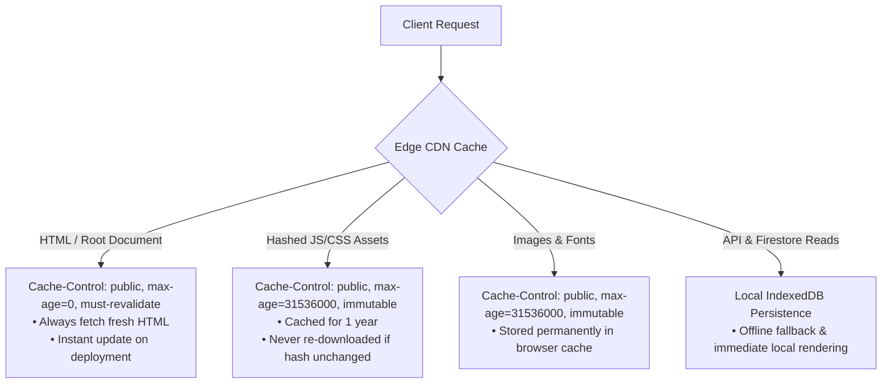
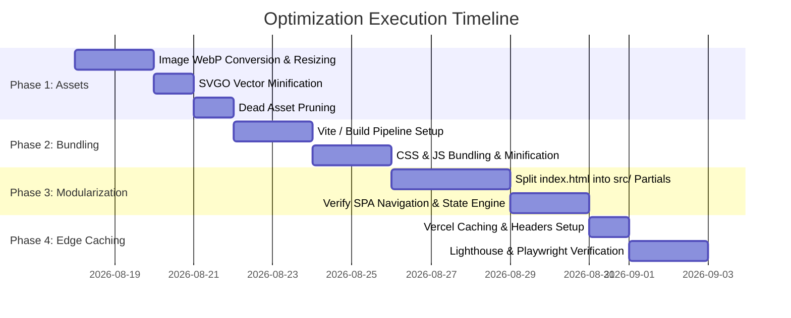

# MilleRace Web Performance & Modularization Plan ⚡

> Comprehensive optimization and architecture roadmap for **MilleRace**, focusing on asset optimization, asset minification/bundling, production HTTP caching, and build-time component modularization.

---

## 📋 Executive Summary & Optimization Targets

| Area | Current Baseline | Target Benchmark | Projected Improvement |
|---|---|---|---|
| **Total Asset Weight** | ~8.5 MB (uncompressed PNGs & JPGs) | < 2.0 MB | **~75% reduction** |
| **HTML File Complexity** | 1,835 lines in single `index.html` | Modular component partials | **High maintainability & zero runtime overhead** |
| **Network Requests** | 7 CSS + 10 JS individual files | 1 bundled CSS + 1 bundled JS | **17 → 2 critical render-blocking requests** |
| **Lighthouse Performance Score** | ~75–85 | 98–100 | **Sub-second LCP & instantaneous TBT** |
| **Cache Hit Efficiency** | Generic CDN caching | Immutable content-hashed assets | **Near-zero bandwidth on repeat visits** |

---



---

## 🎯 Pillar 1: Image Compression, SVG Optimization & Asset Pruning

### 1.1 Problem Statement & Audit
* **Characters (`assets/images/characters/stills/`):** 9 high-resolution PNGs averaging 300 KB – 520 KB each (~3.5 MB total).
* **Backgrounds (`assets/images/backgrounds/`):** `stage-1.png` (1.2 MB) and `stage-2.png` (856 KB) are heavy lossless PNGs.
* **Stage 1 Questions (`assets/images/questions/stage-1/`):** 12 JPEG files ranging from 33 KB to 450 KB (~2.8 MB total).
* **Vector Assets (`assets/images/ui/`, `assets/images/icons/`):** SVGs contain unoptimized editor metadata, comments, and redundant coordinate precision.

### 1.2 Action Plan & Conversion Strategy

#### A. Raster Images → WebP / AVIF
* Convert all character stills and background artwork to **`.webp`** (q=82 for photos/paintings, q=90 for character transparent sprites).
* Target reductions:
  * Character stills: ~3.5 MB → **~600 KB** (82% reduction).
  * Level backgrounds: ~2.0 MB → **~350 KB** (82% reduction).
  * Stage 1 question art: ~2.8 MB → **~500 KB** (80% reduction).
* Scripted batch conversion using `sharp-cli` or a custom Node.js script:

```bash
# Example batch conversion with sharp-cli
npx sharp-cli -i "assets/images/characters/stills/*.png" -o "assets/images/characters/stills/" -f webp -q 85
npx sharp-cli -i "assets/images/backgrounds/*.png" -o "assets/images/backgrounds/" -f webp -q 80
npx sharp-cli -i "assets/images/questions/stage-1/*.jpg" -o "assets/images/questions/stage-1/" -f webp -q 80
```

#### B. SVG Optimization with SVGO
* Process `assets/images/ui/stars.svg`, `assets/images/icons/favicon.svg`, and character vectors through **SVGO**:
  * Strip XML namespaces, editor comments (Figma/Illustrator), and hidden layers.
  * Round coordinate precision to 2 decimal places.
  * Inline or optimize repeated path definitions.

```bash
npx svgo -f assets/images/ui/ -o assets/images/ui/ --multipass
npx svgo -f assets/images/icons/ -o assets/images/icons/ --multipass
```

#### C. Asset Audit & Removal of Dead Files
* Audit codebase references (`grep -r "assets/images"` across `index.html`, `css/`, `js/`) to identify orphan images.
* Remove duplicate placeholders or unused mockups in `assets/images/characters/animations/` and `assets/images/ui/slideshow/`.

---

## ⚡ Pillar 2: CSS / JS Minification & Bundling

### 2.1 Problem Statement & Audit
* **Styles:** 7 distinct HTTP requests:
  * `design-tokens.css`, `main.css`, `landing.css`, `pages.css`, `game-stages.css`, `result.css`, `dev-mode.css`.
* **Scripts:** 10 distinct HTTP requests loaded in sequence:
  * `config.js`, `state.js`, `timer.js`, `leaderboardService.js`, `gameEngine.js`, `ui.js`, `app.js`, `devMode.js`, Firebase SDKs.
* **Overhead:** Multiple round-trips, unminified whitespaces, redundant comments, and uncompressed variable names.

### 2.2 Bundling & Minification Strategy

#### A. CSS Pipeline
* Combine styles into a single cascade-ordered bundle:
  1. `design-tokens.css` (CSS variables & design system foundations)
  2. `main.css` (Base layout, reset, typography, global header/HUD)
  3. `landing.css` (Continuous landing screen & hero animations)
  4. `pages.css` (About Us, Our Team, Our Mission, Leaderboard)
  5. `game-stages.css` (Stage 1–4 puzzles, HUD pills, quiz cards)
  6. `result.css` (Final radar scorecard, character reveal, share modal)
  7. `dev-mode.css` (Dev debug drawer)
* Process via **`lightningcss`** or **`esbuild`** / **`postcss`** with `cssnano`:
  * Remove comments and dead rules.
  * Minify color hex codes and margin/padding shorthands.
  * Output: `dist/css/bundle.[hash].min.css` (~25 KB gzipped).

#### B. JavaScript Pipeline
* Bundle client-side logic using modern ES module bundler (**Vite** or **esbuild**):
  * **Core Game Bundle (`bundle.[hash].min.js`):** `config.js` + `state.js` + `timer.js` + `gameEngine.js` + `ui.js` + `app.js`.
  * **Leaderboard & Cloud Services:** Tree-shaken Firebase SDK imports (`firebase/firestore`, `firebase/app`).
  * **Dev Debug Mode:** Code-split `devMode.js` so it only loads in local development or when `?dev=true` is activated.
* Strip `console.log` statements in production builds.

---

## 🌐 Pillar 3: Setup HTTP Caching & Edge Delivery

### 3.1 Caching Hierarchy



### 3.2 Vercel Edge CDN Configuration (`vercel.json`)
Update `vercel.json` with strict content-aware cache policies:

```json
{
  "version": 2,
  "cleanUrls": true,
  "trailingSlash": false,
  "headers": [
    {
      "source": "/",
      "headers": [
        {
          "key": "Cache-Control",
          "value": "public, max-age=0, must-revalidate"
        }
      ]
    },
    {
      "source": "/(css|js)/bundle.(.*)\\.(css|js)",
      "headers": [
        {
          "key": "Cache-Control",
          "value": "public, max-age=31536000, immutable"
        }
      ]
    },
    {
      "source": "/assets/(.*)",
      "headers": [
        {
          "key": "Cache-Control",
          "value": "public, max-age=31536000, immutable"
        }
      ]
    },
    {
      "source": "/(.*)",
      "headers": [
        {
          "key": "X-Content-Type-Options",
          "value": "nosniff"
        },
        {
          "key": "X-Frame-Options",
          "value": "DENY"
        },
        {
          "key": "X-XSS-Protection",
          "value": "1; mode=block"
        },
        {
          "key": "Referrer-Policy",
          "value": "strict-origin-when-cross-origin"
        }
      ]
    }
  ]
}
```

### 3.3 Resource Preloading & Compression
* Add `<link rel="preload">` for critical font files and hero artwork.
* Enable Brotli (`br`) compression on CDN edge nodes for all text assets (HTML, CSS, JS, SVG).

---

## 🏗️ Pillar 4: Build-Time Component Modularization

### 4.1 Architecture Concept: Modular Dev Source → Single SPA Output
To solve the **1,800+ line `index.html` maintainability issue** without losing instant SPA transitions and memory continuity:
* **Development Phase:** Split pages, modals, and game stages into clean, isolated partial files.
* **Build Phase:** The bundler (Vite or template preprocessor) compiles all partials into a single, minified `dist/index.html`.
* **Runtime Phase:** Seamless in-memory screen switching via `UI.showScreen()` remains 100% intact with 0 ms latency.

### 4.2 Proposed Directory Structure

```text
MilleRace/
├── src/
│   ├── index.html                    # Master entry template with layout skeleton
│   ├── components/                   # Reusable UI fragments
│   │   ├── cosmic-bg.html            # Radial glow + twinkling stars background
│   │   ├── hud.html                  # Top game HUD (timer, keys, stage title)
│   │   ├── nav-bar.html              # Top navigation bar
│   │   └── footer.html               # Global footer
│   ├── modals/                       # Overlay modals
│   │   ├── reg-modal.html            # Registration modal
│   │   ├── lore-modal.html           # Lore briefing modal
│   │   └── share-modal.html          # Result share popup
│   ├── pages/                        # Content & Informational Screens
│   │   ├── screen-landing.html       # Continuous scrollable home screen
│   │   ├── screen-about.html         # About Us & AIAS Frameworks
│   │   ├── screen-team.html          # Our Team & UNMUL collaboration
│   │   ├── screen-mission.html       # 5 Strategic Pillars & dossier
│   │   └── screen-leaderboard.html   # Global & Local Leaderboard screen
│   ├── stages/                       # Game Relay Screens
│   │   ├── screen-stage1.html        # Miller's Art Gallery
│   │   ├── screen-stage2.html        # Jen's Library of Riddles
│   │   ├── screen-stage3.html        # Aidan's Authenticity Lab
│   │   ├── screen-stage4.html        # Lizzy's High-Order Maze
│   │   └── screen-result.html        # Final Radar Scorecard & Archetype
│   ├── css/                          # Modular CSS
│   └── js/                           # ES Modules
├── dist/                             # Compiled production bundle (Single-Page App)
│   ├── index.html                    # Unified, minified HTML
│   ├── assets/                       # Optimized WebP/AVIF/SVG assets
│   ├── css/bundle.[hash].min.css
│   └── js/bundle.[hash].min.js
├── vite.config.js                    # Vite bundler configuration with HTML partials
└── package.json
```

### 4.3 Master Template Example (`src/index.html`)

```html
<!DOCTYPE html>
<html lang="en">
<head>
  <meta charset="UTF-8">
  <meta name="viewport" content="width=device-width, initial-scale=1.0">
  <title>MilleRace - Media & Information Literacy Web Game</title>
  <link rel="stylesheet" href="./css/main.css">
</head>
<body>
  <div id="app">
    <!-- Global HUD -->
    <include src="./components/hud.html"></include>

    <!-- Content Pages -->
    <include src="./pages/screen-landing.html"></include>
    <include src="./pages/screen-about.html"></include>
    <include src="./pages/screen-team.html"></include>
    <include src="./pages/screen-mission.html"></include>
    <include src="./pages/screen-leaderboard.html"></include>

    <!-- Game Stages -->
    <include src="./stages/screen-stage1.html"></include>
    <include src="./stages/screen-stage2.html"></include>
    <include src="./stages/screen-stage3.html"></include>
    <include src="./stages/screen-stage4.html"></include>
    <include src="./stages/screen-result.html"></include>

    <!-- Modals -->
    <include src="./modals/reg-modal.html"></include>
    <include src="./modals/lore-modal.html"></include>
  </div>

  <script type="module" src="./js/app.js"></script>
</body>
</html>
```

### 4.4 Build Tool Configuration (`vite.config.js`)
Using `vite-plugin-html` or `vite-plugin-handlebars` for lightning-fast zero-config HTML composition:

```javascript
import { defineConfig } from 'vite';
import { createHtmlPlugin } from 'vite-plugin-html';

export default defineConfig({
  root: './src',
  build: {
    outDir: '../dist',
    emptyOutDir: true,
    minify: 'esbuild',
    rollupOptions: {
      output: {
        entryFileNames: 'js/bundle.[hash].min.js',
        chunkFileNames: 'js/[name].[hash].min.js',
        assetFileNames: (assetInfo) => {
          if (assetInfo.name.endsWith('.css')) {
            return 'css/bundle.[hash].min.css';
          }
          return 'assets/[name].[hash][extname]';
        }
      }
    }
  },
  plugins: [
    createHtmlPlugin({
      minify: true,
      inject: {
        data: {
          title: 'MilleRace - Media & Information Literacy Web Game'
        }
      }
    })
  ]
});
```

---

## 📅 Phased Implementation Roadmap



---

## 🧪 Verification & Acceptance Criteria

1. **Lighthouse Audit:**
   * Performance Score: **≥ 95** on Mobile & Desktop.
   * Total Blocking Time (TBT): **< 50 ms**.
   * Largest Contentful Paint (LCP): **< 1.2 s**.
   * Cumulative Layout Shift (CLS): **0.00**.
2. **Automated Playwright Regression Tests:**
   * Run `npm run test:chrome` to verify all 4 game stages, registration modal, and leaderboard function flawlessly after bundling.
3. **Network Tab Inspection:**
   * Verify all raster images load in `.webp` format.
   * Verify repeat navigations return `304 Not Modified` or `(from disk cache)` for static assets.
   * Verify total transferred data on initial load is `< 1.5 MB`.

---

[⬅️ Production Deployment Guide](deployment.md) | [Back to Architecture & Tech Stack ➔](architecture-and-tech-stack.md)
