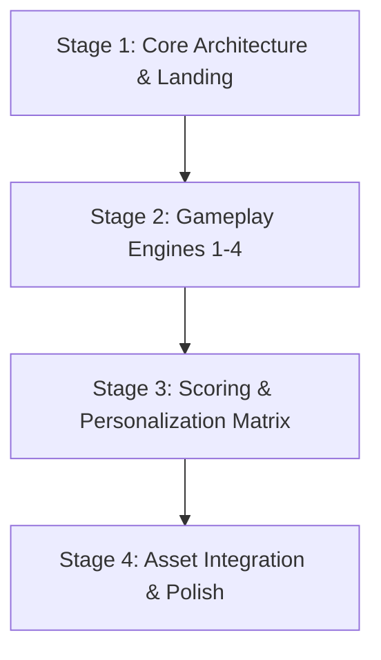

# Implementation Plan - MilleRace Web Game Development

**Project:** MilleRace Web Game (UNESCO Youth Hackathon 2026)  
**Technology Stack:** Vite + Vanilla HTML5 / CSS3 / JavaScript (SPA Architecture)  
**Storage & Telemetry:** LocalStorage + Optional Firebase Client Integration  
**Asset Sources:** `ASSETS/` (Character stills, animations, backgrounds) & `FOTO-SOAL-NO-1/` (Stage 1 visual art questions)  

---

## Executive Summary & Architecture Approach

Based on your preferences, **MilleRace** will be built as a high-performance Single Page Application (SPA) using **Vite + Vanilla JS**. The development is divided into 4 structured stages, building the core UI logic and gameplay engines first with clean placeholders, followed by complete media asset integration from `ASSETS/` and `FOTO-SOAL-NO-1/`, scoring matrix integration, and visual polish.

---

## Summary of User Design Choices
1. **Tech Stack:** Single Page Application (Vanilla HTML/CSS/JS with Vite) for maximum performance, lightweight asset loading, and smooth transitions.
2. **Asset Wiring Strategy:** Build core UI layout and game logic first with styled placeholders, then wire up media assets from `ASSETS/` and `FOTO-SOAL-NO-1/` in Stage 4.
3. **State & Backend Strategy:** LocalStorage state management for offline play and session persistence, plus optional Firebase client logging for player demographics (nickname, age group) and score telemetry.
4. **Implementation Phasing:** 4-Stage Plan (Foundation -> Gameplay Engines -> Scoring/Results -> Asset Wiring & Polish).

---

## Stage 1: Core Foundation, Architecture & User Onboarding

### Objectives
Establish the Vite project scaffolding, build the SPA view router, design token system (warm-toned, crayon-styled theme), user onboarding modal, and global 3-minute stage timer component.

### Components & Tasks
1. **Project Scaffolding & Setup:**
   - Initialize Vite project structure (`index.html`, `src/styles/`, `src/scripts/`, `src/components/`, `public/`).
   - Configure asset pathing for `ASSETS/` and `FOTO-SOAL-NO-1/`.
2. **Design System & CSS Tokens:**
   - Create CSS tokens for warm-toned lighting palettes, crayon-styled font pairings (Google Fonts e.g. *Fredoka* / *Quicksand* / *Comic Neue*), card components, and responsive grid layouts.
3. **SPA View Router & State Engine:**
   - Build lightweight state machine (`src/scripts/state.js`) to manage current stage (`LANDING`, `STAGE_1`, `STAGE_2`, `STAGE_3`, `STAGE_4`, `RESULTS`), player info, key counts, and running score.
4. **Landing & Registration View:**
   - Create the registration page (`src/components/Landing.js`) with input fields for **Nickname** and **Age Group** (6–12, 13–17, 18+).
   - Implement LocalStorage persistence and optional Firebase demographic telemetry event.
5. **Shared 3-Minute Timer Component:**
   - Build `TimerComponent` supporting a 180-second countdown with visual warnings at 30 seconds remaining.

---

## Stage 2: Gameplay Engines & Stage 1–4 Interactive Mechanics

### Objectives
Build the interactive game logic for all 4 stages using placeholder containers, implementing state transitions, key collection, and point accumulation.

### Stage Breakdown

#### 2.1 Stage 1: Miller's Gallery (Visual AIAS Test Engine)
- **Mechanics:** Display 6 visual question cards. Each question presents 3 image options (A, B, C). Player identifies human-created art vs AI-generated decoys under a 3-minute timer.
- **Data Matrix:**
  - **Q1:** Correct: B (Monet & Fragonard vs AI decoy).
  - **Q2:** Correct: C (Charlotte Perkins Gilman & Franz Kafka vs AI decoy).
  - **Q3:** Correct: C (NASA Hubble & Webb vs AI decoy).
  - **Q4:** Correct: A.
  - **Q5:** Correct: Hand-drawn art vs 2 AI pictures.
  - **Q6:** Correct: Hand-drawn art vs 2 AI pictures.
- **Clear Condition:** Key #1 obtained, temporary points saved, transition modal trigger.

#### 2.2 Stage 2: Jen's Door Passwords (Literary General Knowledge Engine)
- **Mechanics:** Interactive "Wonderland" doors view with 10 missing-word title puzzles.
- **Puzzles List:**
  1. Anne of Green **[Gables]**
  2. Harry Potter and The **[Order]** of The Phoenix
  3. The **[Kite]** Runner
  4. Gulliver's **[Travels]**
  5. **[Norwegian]** Wood
  6. The Lion, The Witch & The **[Wardrobe]**
  7. The **[Fault]** in Our Stars
  8. My Year of **[Rest]** and Relaxation
  9. Song of The Open **[Road]**
  10. A Brief History of **[Time]**
- **Clear Condition:** Key #2 obtained, "Old ways won't open new doors!" dialogue, transition trigger.

#### 2.3 Stage 3: Aidan's Floor of Letters (Textual AIAS Discrimination Engine)
- **Mechanics:** Display 5 short text passages. Player selects classification for each: `[Human]`, `[Somewhat Human]`, `[Barely Human]`, or `[Not Human]`.
- **Passages & Correct Keys:**
  - Text 1 (Axolotls): `[Human]`
  - Text 2 (British Foods): `[Somewhat Human]`
  - Text 3 (Valentine's Day): `[Not Human]`
  - Text 4 (1920s Uniforms): `[Not Human]`
  - Text 5 (Chopsticks): `[Human]`
- **Clear Condition:** Key #3 obtained, transition modal trigger.

#### 2.4 Stage 4: Lizzy's Bursting Room (PISA Inferential Reading Engine)
- **Mechanics:** 4 reading comprehension cards with weighted point options (0, 3, or 5 points).
- **Questions & Point Weights:**
  - Q1 (Charlie Golden Ticket): A (3 pts), B (5 pts), C (0 pts).
  - Q2 (Matilda & Mrs Honey): A (0 pts), B (5 pts), C (3 pts).
  - Q3 (IELTS & Postcolonialism): A (0 pts), B (3 pts), C (5 pts).
  - Q4 (Gastrodiplomacy): A (5 pts), B (0 pts), C (0 pts).
- **Clear Condition:** Key #4 obtained, door unlock graphic, transition to Results Page.

---

## Stage 3: Scoring Engine, Character Matching & Personalization Results

### Objectives
Implement total score calculation (0–100 points), character threshold routing, and build the interactive end-game dashboard with custom learning recommendations.

### Components & Tasks
1. **Score Calculation & Archetype Routing:**
   - **Miller (1–25 pts):** PISA Level 1–2 / CEFR A1–A2 (Early Reader).
   - **Jen (26–50 pts):** PISA Level 3–4 / CEFR B1 (Young Adult).
   - **Aidan (51–75 pts):** PISA Level 5 / CEFR B2 (Advanced Reader).
   - **Lizzy (76–100 pts):** PISA Level 6 / CEFR C1 (High Literacy / Wiz).
2. **Interactive Results Dashboard Component:**
   - Display player nickname, total score, keys collected, matched character visual avatar, and quote.
   - Embed interactive slideshow for:
     - **Home Reading Activities** (comics, short stories, diaries, film adaptations, reading clubs).
     - **Recommended Book List with Digital Library Links** (*Charlotte's Web*, *Keluarga Cemara*, *The Fault in Our Stars*, *Laskar Pelangi*, *1984*, *Gadis Kretek*, *Dr Jekyll and Mr Hyde*, *Bumi Manusia*).
     - **MIL & Critical Thinking Toolkits** (Univ of Sheffield, Reuters Fact-Check, MediaSmarts, PSU Bibliometrics, UC Berkeley Graphic Literacy).

---

## Stage 4: Media Asset Integration, Visual Polish & Verification

### Objectives
Wire up existing assets from `ASSETS/` and `FOTO-SOAL-NO-1/`, refine CSS animations, perform cross-device responsive testing, and verify complete game flow.

### Tasks & Integration Plan
1. **Wire Question 1 Image Assets (`FOTO-SOAL-NO-1/`):**
   - Wire `1A.jfif`, `1B.jfif`, `1C.jfif` -> Stage 1 Q1.
   - Wire `2A.jfif`, `2B.jfif`, `2C.jfif` -> Stage 1 Q2.
   - Wire `3A.jfif`, `3B.jfif`, `3C.jfif` -> Stage 1 Q3.
   - Wire `4A.jfif`, `4B.jfif`, `4C.jfif` -> Stage 1 Q4.
2. **Wire Character Graphics (`ASSETS/`):**
   - Integrate `miller`, `JEN`, `Aidan`, and `LIZZY` character stills and walk cycle sprites.
   - Integrate background images from `ASSETS/BG/` into corresponding rooms.
3. **Animations & Micro-interactions:**
   - Character transformation sequences between stages.
   - Key collection popup animations.
   - Button hover states, door unlocking transitions, and progress bar animations.
4. **Verification & Testing:**
   - Test full playthroughs across all 4 character score brackets.
   - Verify timer expiration handling (auto-submit stage when timer reaches 00:00).
   - Validate responsive layout on mobile, tablet, and desktop viewports.

---

## Verification Plan

### Automated & Sanity Build Tests
- `npm run dev`: Launch local Vite dev server and test real-time reloading.
- `npm run build`: Verify production bundle compilation without JS syntax or asset bundling errors.

### Manual Verification Flow
1. **Onboarding:** Register with test nickname and age group -> verify state creation.
2. **Stage 1:** Answer visual Q1-Q6 using image set `FOTO-SOAL-NO-1` -> verify Key #1.
3. **Stage 2:** Complete password puzzle -> verify Key #2.
4. **Stage 3:** Rate text passages -> verify Key #3.
5. **Stage 4:** Answer reading comprehension -> verify Key #4.
6. **Results:** Confirm accurate score summation, character match (Miller/Jen/Aidan/Lizzy), working book links, and MIL activity toolkits.
